# MỤC 2: XÁC ĐỊNH LỚP VÀ QUAN HỆ (MONGODB MODELS)

---

## 2. XÁC ĐỊNH LỚP VÀ QUAN HỆ

### 2.1 Danh Sách Các MongoDB Models (Đã Implement)

#### **2.1.1 Nhóm Lớp Người Dùng (User Domain)**

**1. User Model** ✅ _Đã implement: `backend/src/models/User.js`_
- **Thuộc tính:**
  - _id: ObjectId (PK - auto generated by MongoDB)
  - email: String (required, unique, lowercase)
  - phone: String (required, unique)
  - password: String (required, minlength: 8, hashed with bcrypt, select: false)
  - fullName: String (required)
  - dateOfBirth: Date (optional)
  - gender: Enum ('male', 'female', 'other')
  - avatar: String (URL)
  - role: Enum ('customer', 'admin') - default: 'customer'

  - **OAuth:**
    - googleId: String
    - facebookId: String

  - **Verification:**
    - isEmailVerified: Boolean (default: false)
    - isPhoneVerified: Boolean (default: false)
    - emailVerificationToken: String
    - phoneVerificationOTP: String
    - otpExpires: Date

  - **Security:**
    - passwordResetToken: String
    - passwordResetExpires: Date
    - lastLogin: Date

  - **Preferences:**
    - savedPassengers: Array of embedded documents
      - fullName: String
      - phone: String
      - idCard: String

  - **Loyalty:**
    - loyaltyTier: Enum ('bronze', 'silver', 'gold', 'platinum') - default: 'bronze'
    - totalPoints: Number (default: 0)

  - **Status:**
    - isActive: Boolean (default: true)
    - isBlocked: Boolean (default: false)

  - createdAt: DateTime (auto - timestamps)
  - updatedAt: DateTime (auto - timestamps)

- **Indexes:**
  - email: 1
  - phone: 1
  - googleId: 1
  - facebookId: 1

- **Phương thức:**
  - Pre-save hook: Hash password với bcrypt (salt rounds: 12)
  - comparePassword(candidatePassword): Promise<Boolean>
  - toJSON(): Object (ẩn các field nhạy cảm)

- **Ghi chú:**
  - Trong thiết kế ban đầu có tách Customer và Guest, nhưng trong code hiện tại User model xử lý cả hai roles thông qua field `role` và logic xác thực

**2. BusOperator Model** ✅ _Đã implement: `backend/src/models/BusOperator.js`_
- **Thuộc tính:**
  - _id: ObjectId (PK)
  - companyName: String (required, unique)
  - email: String (required, unique, lowercase)
  - phone: String (required)
  - password: String (required, minlength: 8, hashed, select: false)

  - **Business Info:**
    - businessLicense: String (required)
    - taxCode: String (required)
    - logo: String (URL)
    - description: String
    - website: String

  - **Address (embedded object):**
    - street: String
    - ward: String
    - district: String
    - city: String
    - country: String (default: 'Vietnam')

  - **Bank Info (embedded object):**
    - bankName: String
    - accountNumber: String
    - accountHolder: String

  - **Approval:**
    - verificationStatus: Enum ('pending', 'approved', 'rejected') - default: 'pending'
    - verifiedAt: Date
    - verifiedBy: ObjectId (ref: 'User')
    - rejectionReason: String

  - **Rating:**
    - averageRating: Number (default: 0, min: 0, max: 5)
    - totalReviews: Number (default: 0)

  - **Statistics:**
    - totalTrips: Number (default: 0)
    - totalRevenue: Number (default: 0)

  - **Commission:**
    - commissionRate: Number (default: 5, min: 0, max: 100) // Percentage

  - **Status:**
    - isActive: Boolean (default: true)
    - isSuspended: Boolean (default: false)
    - suspensionReason: String

  - createdAt: DateTime (auto)
  - updatedAt: DateTime (auto)

- **Indexes:**
  - companyName: 1
  - email: 1
  - verificationStatus: 1

- **Phương thức:**
  - Pre-save hook: Hash password với bcrypt (salt rounds: 12)
  - comparePassword(candidatePassword): Promise<Boolean>
  - toJSON(): Object (ẩn password)

#### **2.1.2 Nhóm Lớp Tuyến Đường và Lịch Trình (Route & Schedule Domain)**

**3. Route Model** ✅ _Đã implement: `backend/src/models/Route.js`_
- **Thuộc tính:**
  - _id: ObjectId (PK)
  - operatorId: ObjectId (ref: 'BusOperator', required)
  - routeName: String (required)
  - routeCode: String (required, unique, uppercase)

  - **Origin (embedded locationSchema):**
    - city: String (required)
    - province: String (required)
    - station: String
    - address: String
    - coordinates: { lat: Number, lng: Number }

  - **Destination (embedded locationSchema):**
    - city: String (required)
    - province: String (required)
    - station: String
    - address: String
    - coordinates: { lat: Number, lng: Number }

  - **Pickup & Dropoff Points (embedded pointSchema):**
    - pickupPoints: Array of { name: String, address: String, coordinates: {lat, lng} }
    - dropoffPoints: Array of { name: String, address: String, coordinates: {lat, lng} }

  - **Route Details:**
    - distance: Number (required, min: 0) // km
    - estimatedDuration: Number (required, min: 0) // minutes

  - **Status:**
    - isActive: Boolean (default: true)

  - createdAt: DateTime (auto)
  - updatedAt: DateTime (auto)

- **Indexes:**
  - routeCode: 1
  - operatorId: 1
  - 'origin.city': 1, 'destination.city': 1

- **Ghi chú:**
  - Location và Point được implement dưới dạng embedded schema, không phải separate collection

**4. Bus Model** ✅ _Đã implement: `backend/src/models/Bus.js`_
- **Thuộc tính:**
  - _id: ObjectId (PK)
  - operatorId: ObjectId (ref: 'BusOperator', required)
  - busNumber: String (required, unique, uppercase) // License plate
  - busType: Enum ('limousine', 'sleeper', 'seater', 'double_decker') - required

  - **Seat Configuration (embedded seatLayout):**
    - seatLayout.floors: Number (required, min: 1, max: 2)
    - seatLayout.rows: Number (required)
    - seatLayout.columns: Number (required)
    - seatLayout.layout: Array of Array of String (required) // 2D array representing seat map

  - totalSeats: Number (required, min: 1)

  - **Amenities:**
    - amenities: Array of Enum ('wifi', 'ac', 'toilet', 'water', 'blanket', 'tv', 'usb_charger', 'reading_light')

  - **Images:**
    - images: Array of String (URLs)

  - **Status:**
    - isActive: Boolean (default: true)
    - maintenanceStatus: Enum ('good', 'maintenance', 'repair') - default: 'good'

  - createdAt: DateTime (auto)
  - updatedAt: DateTime (auto)

- **Indexes:**
  - operatorId: 1
  - busNumber: 1

- **Ghi chú:**
  - SeatLayout được implement dưới dạng embedded object, không phải separate collection
  - Seat configuration được lưu trữ dưới dạng 2D array trong field layout

**5. Trip Model** ✅ _Đã implement: `backend/src/models/Trip.js`_
- **Thuộc tính:**
  - _id: ObjectId (PK)
  - operatorId: ObjectId (ref: 'BusOperator', required)
  - routeId: ObjectId (ref: 'Route', required)
  - busId: ObjectId (ref: 'Bus', required)
  - tripCode: String (required, unique, uppercase)

  - **Schedule:**
    - departureTime: Date (required)
    - arrivalTime: Date (required)

  - **Pricing:**
    - basePrice: Number (required, min: 0)

  - **Seat Availability:**
    - availableSeats: Number (required)
    - occupiedSeats: Array of String // Seat numbers
    - lockedSeats: Array of embedded objects
      - seatNumber: String
      - lockedUntil: Date
      - sessionId: String

  - **Staff Assignment:**
    - driver: ObjectId (ref: 'Staff') ⚠️ _Staff model chưa tạo_
    - tripManager: ObjectId (ref: 'Staff') ⚠️ _Staff model chưa tạo_

  - **Status:**
    - status: Enum ('scheduled', 'boarding', 'in_progress', 'completed', 'cancelled') - default: 'scheduled'
    - cancellationReason: String

  - createdAt: DateTime (auto)
  - updatedAt: DateTime (auto)

- **Indexes:**
  - tripCode: 1
  - operatorId: 1, departureTime: 1
  - routeId: 1, departureTime: 1
  - departureTime: 1, status: 1

- **Phương thức:**
  - isSeatAvailable(seatNumber): Boolean
  - lockSeats(seatNumbers, sessionId, durationMinutes = 15): Promise
  - releaseLocks(sessionId): Promise
  - occupySeats(seatNumbers): Promise

- **Ghi chú:**
  - SeatLock được implement dưới dạng embedded array, không phải separate collection
  - Staff model chưa được tạo, cần implement trước khi deploy production

#### **2.1.3 Nhóm Lớp Đặt Vé (Booking Domain)**

**6. Booking Model** ✅ _Đã implement: `backend/src/models/Booking.js`_
- **Thuộc tính:**
  - _id: ObjectId (PK)
  - bookingCode: String (required, unique, uppercase) // Format: BKYYYYMMDD####
  - customerId: ObjectId (ref: 'User', required)
  - tripId: ObjectId (ref: 'Trip', required)
  - operatorId: ObjectId (ref: 'BusOperator', required)

  - **Seats (array of embedded objects):**
    - seats: Array of
      - seatNumber: String (required)
      - passenger: embedded object
        - fullName: String (required)
        - phone: String (required)
        - idCard: String

  - **Pickup & Dropoff (embedded objects):**
    - pickupPoint: { name: String, address: String, coordinates: {lat, lng} }
    - dropoffPoint: { name: String, address: String, coordinates: {lat, lng} }

  - **Pricing:**
    - subtotal: Number (required, min: 0)
    - discount: Number (default: 0, min: 0)
    - totalAmount: Number (required, min: 0)

  - **Voucher:**
    - voucherId: ObjectId (ref: 'Voucher') ⚠️ _Voucher model chưa tạo_
    - voucherCode: String

  - **Contact:**
    - contactEmail: String (required)
    - contactPhone: String (required)
    - notes: String

  - **Status:**
    - status: Enum ('pending', 'confirmed', 'cancelled', 'completed') - default: 'pending'

  - **Cancellation:**
    - cancellationReason: String
    - cancelledAt: Date
    - refundAmount: Number (default: 0)
    - refundStatus: Enum ('pending', 'processed', 'failed')

  - **Check-in:**
    - checkedInSeats: Array of String
    - checkedInAt: Date
    - checkedInBy: ObjectId (ref: 'Staff') ⚠️ _Staff model chưa tạo_

  - createdAt: DateTime (auto)
  - updatedAt: DateTime (auto)

- **Indexes:**
  - bookingCode: 1
  - customerId: 1
  - tripId: 1
  - status: 1
  - createdAt: -1

- **Static Methods:**
  - generateBookingCode(): Promise<String> // Generates unique booking code

- **Ghi chú:**
  - Passenger được implement dưới dạng embedded object trong seats array, không phải separate collection
  - Voucher model chưa được tạo

**7. Ticket Model** ✅ _Đã implement: `backend/src/models/Ticket.js`_
- **Thuộc tính:**
  - _id: ObjectId (PK)
  - ticketCode: String (required, unique, uppercase) // Format: TKYYYYMMDD####
  - bookingId: ObjectId (ref: 'Booking', required)
  - customerId: ObjectId (ref: 'User', required)
  - tripId: ObjectId (ref: 'Trip', required)

  - **Seat & Passenger Info (embedded):**
    - seatNumber: String (required)
    - passenger: embedded object
      - fullName: String (required)
      - phone: String (required)
      - idCard: String

  - **QR Code:**
    - qrCode: String (required) // Base64 image
    - qrData: String (required) // Encrypted data for verification

  - **Ticket PDF:**
    - ticketPDF: String // URL to PDF file

  - **Validation:**
    - isValid: Boolean (default: true)
    - isUsed: Boolean (default: false)
    - usedAt: Date
    - validatedBy: ObjectId (ref: 'Staff') ⚠️ _Staff model chưa tạo_

  - **Trip Details (denormalized for quick access):**
    - tripDetails: embedded object
      - routeName: String
      - origin: String
      - destination: String
      - departureTime: Date
      - busNumber: String
      - operatorName: String

  - createdAt: DateTime (auto)
  - updatedAt: DateTime (auto)

- **Indexes:**
  - ticketCode: 1
  - bookingId: 1
  - qrData: 1
  - customerId: 1

- **Static Methods:**
  - generateTicketCode(): Promise<String>

- **Ghi chú:**
  - Trip details được denormalize để tránh join khi hiển thị vé
  - QR code data được mã hóa để bảo mật

#### **2.1.4 Nhóm Lớp Thanh Toán (Payment Domain)**

**8. Payment Model** ✅ _Đã implement: `backend/src/models/Payment.js`_
- **Thuộc tính:**
  - _id: ObjectId (PK)
  - transactionId: String (required, unique) // Format: TXN{timestamp}{random}
  - bookingId: ObjectId (ref: 'Booking', required)
  - customerId: ObjectId (ref: 'User', required)

  - **Amount:**
    - amount: Number (required, min: 0)
    - currency: String (default: 'VND')

  - **Payment Method:**
    - paymentMethod: Enum ('momo', 'vnpay', 'zalopay', 'shopeepay', 'atm', 'visa', 'mastercard', 'cod') - required

  - **Gateway Info:**
    - gatewayTransactionId: String
    - gatewayResponse: Mixed (object chứa response từ payment gateway)

  - **Status:**
    - status: Enum ('pending', 'success', 'failed', 'refunded') - default: 'pending'

  - **Refund:**
    - refundAmount: Number (default: 0)
    - refundedAt: Date
    - refundReason: String

  - createdAt: DateTime (auto)
  - updatedAt: DateTime (auto)

- **Indexes:**
  - transactionId: 1
  - bookingId: 1
  - customerId: 1
  - status: 1
  - createdAt: -1

- **Static Methods:**
  - generateTransactionId(): Promise<String>

---

### 2.2 Danh Sách Các Models Đã Implement Đầy Đủ (Bổ Sung)

> **✅ Lưu ý:** Các models dưới đây đã được implement đầy đủ với thuộc tính, indexes và phương thức.

#### **Models Ưu Tiên Cao (Critical)**

**9. Staff Model** ✅ _Đã implement: `backend/src/models/Staff.js`_

- **Thuộc tính:**
  - _id: ObjectId (PK - auto generated by MongoDB)
  - operatorId: ObjectId (ref: 'BusOperator', required)
  - employeeCode: String (required, unique, uppercase)
  - fullName: String (required)
  - phone: String (required)
  - email: String (lowercase)
  - dateOfBirth: Date
  - avatar: String (URL)
  - address: String

  - **Role & Status:**
    - role: Enum ('driver', 'tripManager', 'ticketChecker') - required
    - status: Enum ('active', 'onLeave', 'resigned') - default: 'active'

  - **Authentication:**
    - password: String (required, minlength: 8, hashed with bcrypt, select: false)
    - lastLogin: Date

  - **Driver Specific:**
    - licenseNumber: String // Giấy phép lái xe
    - licenseExpiry: Date
    - experienceYears: Number (min: 0)

  - **Statistics:**
    - totalTripsCompleted: Number (default: 0)
    - averageRating: Number (default: 0, min: 0, max: 5)
    - totalRatings: Number (default: 0)

  - createdAt: DateTime (auto - timestamps)
  - updatedAt: DateTime (auto - timestamps)

- **Indexes:**
  - employeeCode: 1
  - operatorId: 1, status: 1
  - role: 1
  - email: 1

- **Phương thức:**
  - Pre-save hook: Hash password với bcrypt (salt rounds: 12)
  - comparePassword(candidatePassword): Promise<Boolean>
  - toJSON(): Object (ẩn password và các field nhạy cảm)
  - Instance method: isAvailable(date): Promise<Boolean> - Kiểm tra staff có rảnh vào ngày cụ thể
  - Static method: findAvailableStaff(operatorId, role, date): Promise<Array> - Tìm nhân viên rảnh

- **Ghi chú:**
  - Model này được reference bởi Trip (driver, tripManager), Booking (checkedInBy), và Ticket (validatedBy)
  - Cần validate licenseExpiry cho role 'driver'

---

**10. Voucher Model** ✅ _Đã implement: `backend/src/models/Voucher.js`_

- **Thuộc tính:**
  - _id: ObjectId (PK)
  - code: String (required, unique, uppercase, minlength: 4, maxlength: 20)
  - title: String (required) // Tên voucher hiển thị
  - description: String

  - **Discount Configuration:**
    - discountType: Enum ('percentage', 'fixed') - required
    - discountValue: Number (required, min: 0)
    - maxDiscount: Number (min: 0) // Giảm tối đa (cho percentage)
    - minOrderValue: Number (default: 0, min: 0) // Giá trị đơn hàng tối thiểu

  - **Validity:**
    - validFrom: Date (required)
    - validTo: Date (required)

  - **Usage Limits:**
    - usageLimit: Number (min: 1) // null = unlimited
    - usedCount: Number (default: 0, min: 0)
    - usageLimitPerUser: Number (default: 1, min: 1)

  - **Scope:**
    - operatorId: ObjectId (ref: 'BusOperator') // null = system-wide voucher
    - applicableRoutes: Array of ObjectId (ref: 'Route') // Áp dụng cho tuyến cụ thể
    - applicableBusTypes: Array of Enum ('limousine', 'sleeper', 'seater', 'double_decker')

  - **Status:**
    - isActive: Boolean (default: true)
    - isPublic: Boolean (default: true) // false = voucher riêng tư (qua email)

  - createdAt: DateTime (auto)
  - updatedAt: DateTime (auto)

- **Indexes:**
  - code: 1
  - operatorId: 1, isActive: 1
  - validFrom: 1, validTo: 1
  - isActive: 1, validFrom: 1, validTo: 1

- **Phương thức:**
  - Instance method: isValid(currentDate = new Date()): Boolean - Kiểm tra voucher còn hiệu lực
  - Instance method: canBeUsed(userId, orderValue, routeId, busType): Promise<Boolean> - Kiểm tra có thể sử dụng
  - Instance method: calculateDiscount(orderValue): Number - Tính số tiền giảm
  - Instance method: incrementUsage(): Promise - Tăng số lần sử dụng
  - Static method: findValidVouchers(operatorId, routeId, busType): Promise<Array> - Tìm voucher khả dụng
  - Pre-save hook: Validate validTo > validFrom

- **Ghi chú:**
  - Được reference bởi Booking model
  - Cần track usage per user trong separate collection nếu cần chi tiết

---

#### **Models Ưu Tiên Trung Bình (Nice to Have)**

**11. Review Model** ✅ _Đã implement: `backend/src/models/Review.js`_

- **Thuộc tính:**
  - _id: ObjectId (PK)
  - bookingId: ObjectId (ref: 'Booking', required, unique) // Một booking chỉ có 1 review
  - customerId: ObjectId (ref: 'User', required)
  - operatorId: ObjectId (ref: 'BusOperator', required)
  - tripId: ObjectId (ref: 'Trip')

  - **Ratings:**
    - overallRating: Number (required, min: 1, max: 5)
    - busRating: Number (min: 1, max: 5)
    - driverRating: Number (min: 1, max: 5)
    - punctualityRating: Number (min: 1, max: 5)
    - serviceRating: Number (min: 1, max: 5)

  - **Review Content:**
    - comment: String (maxlength: 1000)
    - images: Array of String (URLs) // Ảnh đánh giá

  - **Status:**
    - isApproved: Boolean (default: false) // Admin duyệt
    - isHidden: Boolean (default: false)
    - approvedBy: ObjectId (ref: 'User')
    - approvedAt: Date

  - **Response:**
    - operatorResponse: String // Phản hồi từ nhà xe
    - respondedAt: Date

  - **Helpful:**
    - helpfulCount: Number (default: 0) // Số người thấy hữu ích

  - createdAt: DateTime (auto)
  - updatedAt: DateTime (auto)

- **Indexes:**
  - bookingId: 1
  - customerId: 1
  - operatorId: 1, isApproved: 1
  - tripId: 1
  - overallRating: 1
  - createdAt: -1

- **Phương thức:**
  - Instance method: approve(adminId): Promise - Duyệt đánh giá
  - Instance method: hide(): Promise - Ẩn đánh giá
  - Instance method: addOperatorResponse(response): Promise - Thêm phản hồi từ nhà xe
  - Static method: getAverageRatings(operatorId): Promise<Object> - Tính rating trung bình
  - Post-save hook: Cập nhật averageRating và totalReviews của BusOperator

- **Ghi chú:**
  - Chỉ cho phép review sau khi chuyến xe completed
  - Cần validate booking đã hoàn thành trước khi tạo review

---

**12. Notification Model** ✅ _Đã implement: `backend/src/models/Notification.js`_

- **Thuộc tính:**
  - _id: ObjectId (PK)
  - userId: ObjectId (ref: 'User', required)

  - **Notification Type:**
    - type: Enum ('email', 'sms', 'push', 'in_app') - required
    - category: Enum ('booking', 'payment', 'promotion', 'system', 'reminder') - required

  - **Content:**
    - title: String (required, maxlength: 200)
    - content: String (required, maxlength: 2000)
    - imageUrl: String
    - actionUrl: String // Deep link hoặc URL

  - **Delivery:**
    - status: Enum ('pending', 'sent', 'failed', 'read') - default: 'pending'
    - sentAt: Date
    - readAt: Date
    - failureReason: String

  - **Priority:**
    - priority: Enum ('low', 'normal', 'high', 'urgent') - default: 'normal'

  - **Metadata:**
    - metadata: Mixed // Object chứa thông tin bổ sung (bookingId, tripId, etc.)

  - **Scheduling:**
    - scheduledFor: Date // Gửi vào thời điểm cụ thể
    - expiresAt: Date

  - createdAt: DateTime (auto)
  - updatedAt: DateTime (auto)

- **Indexes:**
  - userId: 1, status: 1
  - userId: 1, readAt: 1
  - type: 1, status: 1
  - scheduledFor: 1, status: 1
  - createdAt: -1

- **Phương thức:**
  - Instance method: markAsSent(): Promise - Đánh dấu đã gửi
  - Instance method: markAsRead(): Promise - Đánh dấu đã đọc
  - Instance method: markAsFailed(reason): Promise - Đánh dấu thất bại
  - Static method: createBookingNotification(userId, bookingId, type): Promise<Notification>
  - Static method: getPendingNotifications(limit = 100): Promise<Array> - Lấy notifications chưa gửi
  - Static method: getUnreadCount(userId): Promise<Number> - Đếm thông báo chưa đọc
  - Static method: markAllAsRead(userId): Promise - Đánh dấu tất cả đã đọc

- **Ghi chú:**
  - Làm việc với notificationService.js để gửi thông báo
  - Có thể dùng cron job để gửi scheduled notifications

---

**13. Content Model** ✅ _Đã implement: `backend/src/models/Content.js`_

- **Thuộc tính:**
  - _id: ObjectId (PK)

  - **Content Type:**
    - type: Enum ('banner', 'blog', 'faq', 'policy', 'announcement', 'promotion') - required
    - slug: String (required, unique, lowercase) // URL-friendly

  - **Content:**
    - title: String (required, maxlength: 200)
    - subtitle: String (maxlength: 300)
    - body: String (required) // HTML hoặc Markdown
    - excerpt: String (maxlength: 500) // Mô tả ngắn
    - imageUrl: String
    - thumbnailUrl: String
    - tags: Array of String

  - **SEO:**
    - metaTitle: String
    - metaDescription: String
    - metaKeywords: Array of String

  - **Display:**
    - isActive: Boolean (default: true)
    - order: Number (default: 0) // Thứ tự hiển thị
    - featured: Boolean (default: false) // Nổi bật

  - **Author:**
    - createdBy: ObjectId (ref: 'User', required)
    - updatedBy: ObjectId (ref: 'User')

  - **Analytics:**
    - viewCount: Number (default: 0)
    - likeCount: Number (default: 0)

  - **Scheduling:**
    - publishedAt: Date
    - expiresAt: Date

  - createdAt: DateTime (auto)
  - updatedAt: DateTime (auto)

- **Indexes:**
  - slug: 1
  - type: 1, isActive: 1
  - type: 1, order: 1
  - featured: 1, isActive: 1
  - createdBy: 1
  - publishedAt: -1

- **Phương thức:**
  - Instance method: incrementView(): Promise - Tăng lượt xem
  - Instance method: incrementLike(): Promise - Tăng lượt thích
  - Instance method: publish(): Promise - Xuất bản content
  - Instance method: unpublish(): Promise - Gỡ xuất bản
  - Static method: getFeaturedContent(type, limit = 5): Promise<Array> - Lấy content nổi bật
  - Static method: getContentByType(type, options): Promise<Array> - Lấy theo loại
  - Pre-save hook: Generate slug từ title nếu chưa có
  - Pre-save hook: Set publishedAt nếu chuyển isActive từ false -> true

- **Ghi chú:**
  - Dùng cho CMS (Content Management System)
  - Body có thể chứa HTML hoặc Markdown tùy implementation

---

**14. SupportTicket Model** ✅ _Đã implement: `backend/src/models/SupportTicket.js`_

- **Thuộc tính:**
  - _id: ObjectId (PK)
  - ticketNumber: String (required, unique, uppercase) // Format: TK{YYYYMMDD}{####}
  - userId: ObjectId (ref: 'User', required)

  - **Ticket Info:**
    - subject: String (required, maxlength: 200)
    - description: String (required, maxlength: 2000)
    - category: Enum ('booking', 'payment', 'refund', 'technical', 'complaint', 'other') - required
    - relatedBookingId: ObjectId (ref: 'Booking')
    - relatedPaymentId: ObjectId (ref: 'Payment')

  - **Priority & Status:**
    - priority: Enum ('low', 'medium', 'high', 'urgent') - default: 'medium'
    - status: Enum ('open', 'assigned', 'inProgress', 'resolved', 'closed', 'cancelled') - default: 'open'

  - **Assignment:**
    - assignedTo: ObjectId (ref: 'User') // Admin/Support user
    - assignedAt: Date

  - **Messages (embedded array):**
    - messages: Array of embedded objects
      - sender: ObjectId (ref: 'User', required)
      - senderType: Enum ('customer', 'admin')
      - message: String (required)
      - attachments: Array of String (URLs)
      - createdAt: Date (default: Date.now)

  - **Resolution:**
    - resolutionNote: String
    - resolvedAt: Date
    - resolvedBy: ObjectId (ref: 'User')
    - closedAt: Date

  - **Rating:**
    - satisfactionRating: Number (min: 1, max: 5) // Đánh giá sau khi giải quyết
    - feedbackComment: String

  - createdAt: DateTime (auto)
  - updatedAt: DateTime (auto)

- **Indexes:**
  - ticketNumber: 1
  - userId: 1, status: 1
  - assignedTo: 1, status: 1
  - category: 1, status: 1
  - status: 1, priority: 1
  - createdAt: -1

- **Phương thức:**
  - Static method: generateTicketNumber(): Promise<String> - Tạo mã ticket
  - Instance method: addMessage(senderId, senderType, message, attachments): Promise - Thêm tin nhắn
  - Instance method: assignTo(adminId): Promise - Gán cho admin
  - Instance method: updateStatus(newStatus): Promise - Cập nhật trạng thái
  - Instance method: resolve(adminId, note): Promise - Đánh dấu đã giải quyết
  - Instance method: close(): Promise - Đóng ticket
  - Instance method: addRating(rating, comment): Promise - Thêm đánh giá
  - Static method: getTicketsByStatus(status, options): Promise<Array>
  - Static method: getMyTickets(userId, options): Promise<Array>
  - Static method: getAssignedTickets(adminId, options): Promise<Array>
  - Pre-save hook: Tự động set assignedAt khi có assignedTo
  - Post-save hook: Gửi notification khi có message mới

- **Ghi chú:**
  - Messages được lưu dưới dạng embedded array
  - Cần real-time updates cho chat (có thể dùng Socket.io)

---

### 2.3 Tóm Tắt Trạng Thái Implementation

| # | Model | Status | File Path | Priority |
|---|-------|--------|-----------|----------|
| 1 | User | ✅ Implemented | `backend/src/models/User.js` | - |
| 2 | BusOperator | ✅ Implemented | `backend/src/models/BusOperator.js` | - |
| 3 | Route | ✅ Implemented | `backend/src/models/Route.js` | - |
| 4 | Bus | ✅ Implemented | `backend/src/models/Bus.js` | - |
| 5 | Trip | ✅ Implemented | `backend/src/models/Trip.js` | - |
| 6 | Booking | ✅ Implemented | `backend/src/models/Booking.js` | - |
| 7 | Ticket | ✅ Implemented | `backend/src/models/Ticket.js` | - |
| 8 | Payment | ✅ Implemented | `backend/src/models/Payment.js` | - |
| 9 | **Staff** | ✅ **Implemented** | `backend/src/models/Staff.js` | **CRITICAL** |
| 10 | **Voucher** | ✅ **Implemented** | `backend/src/models/Voucher.js` | **IMPORTANT** |
| 11 | Review | ✅ Implemented | `backend/src/models/Review.js` | Nice to Have |
| 12 | Notification | ✅ Implemented | `backend/src/models/Notification.js` | Nice to Have |
| 13 | Content | ✅ Implemented | `backend/src/models/Content.js` | Nice to Have |
| 14 | SupportTicket | ✅ Implemented | `backend/src/models/SupportTicket.js` | Nice to Have |

---

### 2.4 Class Diagram (Sơ Đồ Lớp - MongoDB Models Implemented)

> **Chú thích:** Sơ đồ này hiển thị tất cả các models đã được implement đầy đủ.

```mermaid
%%{init: {'theme':'dark'}}%%
classDiagram
    %% ========== IMPLEMENTED MODELS ==========

    %% User Model
    class User {
        <<MongoDB Model>>
        -ObjectId _id
        -String email*
        -String phone*
        -String password
        -String fullName*
        -Date dateOfBirth
        -Enum gender
        -String avatar
        -Enum role
        -String googleId
        -String facebookId
        -Boolean isEmailVerified
        -Boolean isPhoneVerified
        -Array savedPassengers
        -Enum loyaltyTier
        -Number totalPoints
        -Boolean isActive
        -Boolean isBlocked
        +comparePassword()
        +toJSON()
    }

    %% BusOperator Model
    class BusOperator {
        <<MongoDB Model>>
        -ObjectId _id
        -String companyName*
        -String email*
        -String phone*
        -String password
        -String businessLicense*
        -String taxCode*
        -String logo
        -Object address
        -Object bankAccount
        -Enum verificationStatus
        -Date verifiedAt
        -Number averageRating
        -Number totalReviews
        -Number totalTrips
        -Number totalRevenue
        -Number commissionRate
        -Boolean isActive
        -Boolean isSuspended
        +comparePassword()
        +toJSON()
    }

    %% Route Model
    class Route {
        <<MongoDB Model>>
        -ObjectId _id
        -ObjectId operatorId*
        -String routeName*
        -String routeCode*
        -Object origin*
        -Object destination*
        -Array pickupPoints
        -Array dropoffPoints
        -Number distance*
        -Number estimatedDuration*
        -Boolean isActive
    }

    %% Bus Model
    class Bus {
        <<MongoDB Model>>
        -ObjectId _id
        -ObjectId operatorId*
        -String busNumber*
        -Enum busType*
        -Number totalSeats*
        -Object seatLayout*
        -Array amenities
        -Array images
        -Boolean isActive
        -Enum maintenanceStatus
    }

    %% Trip Model
    class Trip {
        <<MongoDB Model>>
        -ObjectId _id
        -ObjectId operatorId*
        -ObjectId routeId*
        -ObjectId busId*
        -String tripCode*
        -Date departureTime*
        -Date arrivalTime*
        -Number basePrice*
        -Number availableSeats*
        -Array occupiedSeats
        -Array lockedSeats
        -ObjectId driver
        -ObjectId tripManager
        -Enum status
        +isSeatAvailable()
        +lockSeats()
        +releaseLocks()
        +occupySeats()
    }

    %% Booking Model
    class Booking {
        <<MongoDB Model>>
        -ObjectId _id
        -String bookingCode*
        -ObjectId customerId*
        -ObjectId tripId*
        -ObjectId operatorId*
        -Array seats*
        -Object pickupPoint
        -Object dropoffPoint
        -Number subtotal*
        -Number discount
        -Number totalAmount*
        -ObjectId voucherId
        -String voucherCode
        -String contactEmail*
        -String contactPhone*
        -Enum status
        -Date cancelledAt
        -Number refundAmount
        -Array checkedInSeats
        +generateBookingCode()
    }

    %% Ticket Model
    class Ticket {
        <<MongoDB Model>>
        -ObjectId _id
        -String ticketCode*
        -ObjectId bookingId*
        -ObjectId customerId*
        -ObjectId tripId*
        -String seatNumber*
        -Object passenger*
        -String qrCode*
        -String qrData*
        -String ticketPDF
        -Boolean isValid
        -Boolean isUsed
        -Date usedAt
        -ObjectId validatedBy
        -Object tripDetails
        +generateTicketCode()
    }

    %% Payment Model
    class Payment {
        <<MongoDB Model>>
        -ObjectId _id
        -String transactionId*
        -ObjectId bookingId*
        -ObjectId customerId*
        -Number amount*
        -String currency
        -Enum paymentMethod*
        -String gatewayTransactionId
        -Mixed gatewayResponse
        -Enum status
        -Number refundAmount
        -Date refundedAt
        -String refundReason
        +generateTransactionId()
    }

    %% Staff Model
    class Staff {
        <<MongoDB Model>>
        -ObjectId _id
        -ObjectId operatorId*
        -String employeeCode*
        -String fullName*
        -String phone*
        -String email
        -Enum role*
        -Enum status
        -String password
        -String licenseNumber
        -Date licenseExpiry
        -Number experienceYears
        -Number totalTripsCompleted
        -Number averageRating
        +comparePassword()
        +toJSON()
        +isAvailable()
        +findAvailableStaff()
    }

    %% Voucher Model
    class Voucher {
        <<MongoDB Model>>
        -ObjectId _id
        -String code*
        -String title*
        -Enum discountType*
        -Number discountValue*
        -Number maxDiscount
        -Number minOrderValue
        -Date validFrom*
        -Date validTo*
        -Number usageLimit
        -Number usedCount
        -ObjectId operatorId
        -Array applicableRoutes
        -Array applicableBusTypes
        -Boolean isActive
        -Boolean isPublic
        +isValid()
        +canBeUsed()
        +calculateDiscount()
        +incrementUsage()
        +findValidVouchers()
    }

    %% Review Model
    class Review {
        <<MongoDB Model>>
        -ObjectId _id
        -ObjectId bookingId*
        -ObjectId customerId*
        -ObjectId operatorId*
        -ObjectId tripId
        -Number overallRating*
        -Number busRating
        -Number driverRating
        -Number punctualityRating
        -Number serviceRating
        -String comment
        -Array images
        -Boolean isApproved
        -String operatorResponse
        -Number helpfulCount
        +approve()
        +hide()
        +addOperatorResponse()
        +getAverageRatings()
    }

    %% Notification Model
    class Notification {
        <<MongoDB Model>>
        -ObjectId _id
        -ObjectId userId*
        -Enum type*
        -Enum category*
        -String title*
        -String content*
        -String imageUrl
        -String actionUrl
        -Enum status
        -Date sentAt
        -Date readAt
        -Enum priority
        -Mixed metadata
        -Date scheduledFor
        +markAsSent()
        +markAsRead()
        +markAsFailed()
        +createBookingNotification()
        +getPendingNotifications()
        +getUnreadCount()
    }

    %% Content Model
    class Content {
        <<MongoDB Model>>
        -ObjectId _id
        -Enum type*
        -String slug*
        -String title*
        -String subtitle
        -String body*
        -String excerpt
        -String imageUrl
        -Array tags
        -Boolean isActive
        -Number order
        -Boolean featured
        -ObjectId createdBy*
        -Number viewCount
        -Date publishedAt
        +incrementView()
        +incrementLike()
        +publish()
        +unpublish()
        +getFeaturedContent()
        +getContentByType()
    }

    %% SupportTicket Model
    class SupportTicket {
        <<MongoDB Model>>
        -ObjectId _id
        -String ticketNumber*
        -ObjectId userId*
        -String subject*
        -String description*
        -Enum category*
        -ObjectId relatedBookingId
        -Enum priority
        -Enum status
        -ObjectId assignedTo
        -Array messages
        -String resolutionNote
        -Date resolvedAt
        -Number satisfactionRating
        +generateTicketNumber()
        +addMessage()
        +assignTo()
        +updateStatus()
        +resolve()
        +close()
        +addRating()
    }

    %% ========== RELATIONSHIPS ==========

    %% User relationships
    User "1" -- "0..*" Booking : makes
    User "1" -- "0..*" Review : writes
    User "1" -- "0..*" Notification : receives
    User "1" -- "0..*" Content : creates
    User "1" -- "0..*" SupportTicket : creates

    %% BusOperator relationships
    BusOperator "1" -- "0..*" Route : manages
    BusOperator "1" -- "0..*" Bus : owns
    BusOperator "1" -- "0..*" Trip : operates
    BusOperator "1" -- "0..*" Staff : employs
    BusOperator "1" -- "0..*" Voucher : creates
    BusOperator "1" -- "0..*" Review : receives

    %% Trip relationships
    Trip "1" -- "1" Route : follows
    Trip "1" -- "1" Bus : uses
    Trip "1" -- "0..1" Staff : has driver
    Trip "1" -- "0..1" Staff : has tripManager
    Trip "1" -- "0..*" Booking : has
    Trip "1" -- "0..*" Review : receives

    %% Booking relationships
    Booking "1" -- "1" Trip : for
    Booking "1" -- "1" User : by
    Booking "1" -- "1" BusOperator : with
    Booking "1" -- "0..1" Voucher : uses
    Booking "1" -- "1..*" Ticket : generates
    Booking "1" -- "1" Payment : has
    Booking "1" -- "0..1" Review : has
    Booking "1" -- "0..*" SupportTicket : relates

    %% Payment relationships
    Payment "1" -- "1" Booking : for
    Payment "1" -- "1" User : by

    %% Ticket relationships
    Ticket "1" -- "1" Booking : from
    Ticket "1" -- "1" Trip : for
    Ticket "1" -- "0..1" Staff : validated by

    %% Staff relationships
    Staff "1" -- "0..*" Trip : operates
    Staff "1" -- "0..*" Ticket : validates

    %% Styling
    style User fill:#4a9eff
    style BusOperator fill:#4a9eff
    style Route fill:#4a9eff
    style Bus fill:#4a9eff
    style Trip fill:#4a9eff
    style Booking fill:#4a9eff
    style Ticket fill:#4a9eff
    style Payment fill:#4a9eff
    style Staff fill:#90EE90
    style Voucher fill:#90EE90
    style Review fill:#FFD700
    style Notification fill:#FFD700
    style Content fill:#FFD700
    style SupportTicket fill:#FFD700
```

**Ghi chú Class Diagram:**
- 🔵 **Màu xanh dương:** Models đã implement từ trước (User, BusOperator, Route, Bus, Trip, Booking, Ticket, Payment)
- 🟢 **Màu xanh lá:** Models critical mới implement (Staff, Voucher)
- 🟡 **Màu vàng:** Models nice-to-have mới implement (Review, Notification, Content, SupportTicket)
- `*` = Required field
- Embedded documents (như `passenger`, `seatLayout`, `lockedSeats`) không được hiển thị riêng vì được nhúng trong parent model

---

### 2.5 Quan Hệ Giữa Các Lớp (Dựa Trên Code Thực Tế)

#### **2.5.1 Quan hệ Reference (ObjectId References)**

Trong MongoDB, các models được liên kết thông qua ObjectId references:

**User Model:**
- `User` ← `Booking.customerId` (1:N) - Một user có nhiều bookings
- `User` ← `Payment.customerId` (1:N) - Một user có nhiều payments
- `User` ← `Ticket.customerId` (1:N) - Một user có nhiều tickets
- `User` ← `Review.customerId` (1:N) - Một user có nhiều reviews
- `User` ← `Notification.userId` (1:N) - Một user có nhiều notifications
- `User` ← `Content.createdBy` (1:N) - Một user tạo nhiều contents
- `User` ← `SupportTicket.userId` (1:N) - Một user có nhiều tickets

**BusOperator Model:**
- `BusOperator` ← `Route.operatorId` (1:N) - Một nhà xe quản lý nhiều tuyến
- `BusOperator` ← `Bus.operatorId` (1:N) - Một nhà xe sở hữu nhiều xe
- `BusOperator` ← `Trip.operatorId` (1:N) - Một nhà xe vận hành nhiều chuyến
- `BusOperator` ← `Booking.operatorId` (1:N) - Một nhà xe nhận nhiều bookings
- `BusOperator` ← `Staff.operatorId` (1:N) - Một nhà xe có nhiều nhân viên
- `BusOperator` ← `Voucher.operatorId` (1:N) - Một nhà xe tạo nhiều vouchers
- `BusOperator` ← `Review.operatorId` (1:N) - Một nhà xe nhận nhiều reviews

**Route Model:**
- `Route` ← `Trip.routeId` (1:N) - Một tuyến có nhiều chuyến
- `Route` ← `Voucher.applicableRoutes` (N:M) - Voucher áp dụng cho nhiều tuyến

**Bus Model:**
- `Bus` ← `Trip.busId` (1:N) - Một xe thực hiện nhiều chuyến

**Trip Model:**
- `Trip` ← `Booking.tripId` (1:N) - Một chuyến có nhiều bookings
- `Trip` ← `Ticket.tripId` (1:N) - Một chuyến có nhiều tickets
- `Trip` → `Staff (driver)` (N:1) - Nhiều chuyến có thể có cùng tài xế
- `Trip` → `Staff (tripManager)` (N:1) - Nhiều chuyến có thể có cùng quản lý
- `Trip` ← `Review.tripId` (1:N) - Một chuyến có nhiều reviews

**Booking Model:**
- `Booking` ← `Ticket.bookingId` (1:N) - Một booking tạo nhiều tickets
- `Booking` ← `Payment.bookingId` (1:1) - Một booking có một payment
- `Booking` → `Voucher.voucherId` (N:1) - Nhiều bookings có thể dùng cùng voucher
- `Booking` → `Staff.checkedInBy` (N:1) - Nhiều bookings được check-in bởi cùng staff
- `Booking` ← `Review.bookingId` (1:1) - Một booking có một review
- `Booking` ← `SupportTicket.relatedBookingId` (1:N) - Một booking có thể có nhiều tickets

**Ticket Model:**
- `Ticket` → `Staff.validatedBy` (N:1) - Nhiều tickets được validate bởi cùng staff

**Staff Model:**
- `Staff` ← `Trip.driver` (1:N) - Một staff có thể lái nhiều chuyến
- `Staff` ← `Trip.tripManager` (1:N) - Một staff có thể quản lý nhiều chuyến
- `Staff` ← `Booking.checkedInBy` (1:N) - Một staff check-in nhiều bookings
- `Staff` ← `Ticket.validatedBy` (1:N) - Một staff validate nhiều tickets

#### **2.5.2 Quan hệ Embedded (Nested Documents)**

Các documents được nhúng trực tiếp trong parent document (không phải reference):

**User Model:**
- `savedPassengers`: Array of embedded { fullName, phone, idCard }

**BusOperator Model:**
- `address`: Embedded { street, ward, district, city, country }
- `bankAccount`: Embedded { bankName, accountNumber, accountHolder }

**Route Model:**
- `origin`: Embedded { city, province, station, address, coordinates }
- `destination`: Embedded { city, province, station, address, coordinates }
- `pickupPoints`: Array of embedded { name, address, coordinates }
- `dropoffPoints`: Array of embedded { name, address, coordinates }

**Bus Model:**
- `seatLayout`: Embedded { floors, rows, columns, layout }

**Trip Model:**
- `occupiedSeats`: Array of String
- `lockedSeats`: Array of embedded { seatNumber, lockedUntil, sessionId }

**Booking Model:**
- `seats`: Array of embedded { seatNumber, passenger: { fullName, phone, idCard } }
- `pickupPoint`: Embedded { name, address, coordinates }
- `dropoffPoint`: Embedded { name, address, coordinates }

**Ticket Model:**
- `passenger`: Embedded { fullName, phone, idCard }
- `tripDetails`: Embedded { routeName, origin, destination, departureTime, busNumber, operatorName }

**Payment Model:**
- `gatewayResponse`: Mixed (object chứa raw response từ payment gateway)

**SupportTicket Model:**
- `messages`: Array of embedded { sender, senderType, message, attachments, createdAt }

#### **2.5.3 Đặc Điểm Thiết Kế MongoDB**

**1. Denormalization (Phi chuẩn hóa):**
- `Ticket.tripDetails` chứa thông tin denormalized từ Trip, Route, Bus - Tránh join khi hiển thị vé
- `Booking.operatorId` duplicate từ Trip - Optimize query bookings by operator

**2. Embedded vs Referenced:**
- **Embedded:** Dữ liệu không cần query riêng (passenger, seatLayout, lockedSeats, messages)
- **Referenced:** Dữ liệu cần query độc lập hoặc được share (User, Trip, Bus, Route, Staff, Voucher)

**3. Array Fields:**
- `occupiedSeats`, `lockedSeats`, `seats`, `pickupPoints`, `messages`, `applicableRoutes` - Cho phép query linh hoạt
- Indexes được tạo trên các array fields quan trọng

---

### 2.6 Tóm Tắt Index Strategy

| Model | Indexes | Lý Do |
|-------|---------|-------|
| **User** | email, phone, googleId, facebookId | Đăng nhập và authentication |
| **BusOperator** | companyName, email, verificationStatus | Tìm kiếm và quản lý nhà xe |
| **Route** | routeCode, operatorId, origin.city+destination.city | Tìm kiếm tuyến đường |
| **Bus** | operatorId, busNumber | Quản lý xe theo nhà xe |
| **Trip** | tripCode, operatorId+departureTime, routeId+departureTime, departureTime+status | Tìm kiếm và lọc chuyến xe |
| **Booking** | bookingCode, customerId, tripId, status, createdAt | Quản lý và tra cứu booking |
| **Ticket** | ticketCode, bookingId, qrData, customerId | Validate và tra cứu vé |
| **Payment** | transactionId, bookingId, customerId, status, createdAt | Theo dõi giao dịch |
| **Staff** | employeeCode, operatorId+status, role, email | Tìm kiếm nhân viên theo operator, role và status |
| **Voucher** | code, operatorId+isActive, validFrom+validTo | Validate voucher và tìm voucher khả dụng |
| **Review** | bookingId, customerId, operatorId+isApproved, tripId, createdAt | Hiển thị reviews theo nhà xe, trip, và sắp xếp |
| **Notification** | userId+status, userId+readAt, type+status, scheduledFor+status | Query notifications chưa đọc và scheduled |
| **Content** | slug, type+isActive, type+order, featured+isActive | SEO-friendly URLs và hiển thị content |
| **SupportTicket** | ticketNumber, userId+status, assignedTo+status, category+status | Quản lý và phân công tickets |

---

**Ghi chú chung:**
- Tất cả models đều có timestamps (createdAt, updatedAt)
- Các phương thức static phục vụ business logic phức tạp
- Các phương thức instance phục vụ operations trên document cụ thể
- Hooks (pre/post-save) đảm bảo data integrity và side effects
- Composite indexes được tạo cho các query patterns phổ biến

---

## KẾT LUẬN

Tài liệu này đã mô tả chi tiết **14 MongoDB Models** cho hệ thống đặt vé xe khách trực tuyến, bao gồm:

✅ **8 Models đã implement từ trước:**
- User, BusOperator, Route, Bus, Trip, Booking, Ticket, Payment

✅ **6 Models mới implement đầy đủ:**
- **Critical:** Staff, Voucher
- **Nice to Have:** Review, Notification, Content, SupportTicket

Mỗi model đều được thiết kế với:
- **Thuộc tính:** Đầy đủ các fields cần thiết với validation
- **Indexes:** Tối ưu hóa performance cho các query patterns
- **Phương thức:** Business logic và helper functions
- **Relationships:** References và embedded documents phù hợp với MongoDB best practices

Thiết kế này cân bằng giữa:
- **Normalization vs Denormalization:** Để tối ưu performance
- **Embedded vs Referenced:** Dựa trên access patterns
- **Scalability:** Indexes và data modeling cho future growth
