# Lược Đồ Quan Hệ ERD - QuickRide

## Tổng quan hệ thống
QuickRide là hệ thống đặt vé xe khách trực tuyến sử dụng MongoDB với Mongoose ODM. Hệ thống quản lý người dùng, nhà xe, xe buýt, tuyến đường, chuyến đi, đặt vé và thanh toán.

## Sơ Đồ ERD

```mermaid
erDiagram
    User ||--o{ Booking : "đặt vé"
    User ||--o{ Ticket : "sở hữu"
    User ||--o{ Payment : "thanh toán"
    User ||--o{ BusOperator : "xác minh (admin)"

    BusOperator ||--o{ Bus : "sở hữu"
    BusOperator ||--o{ Route : "quản lý"
    BusOperator ||--o{ Trip : "vận hành"
    BusOperator ||--o{ Booking : "nhận đặt vé"

    Bus ||--o{ Trip : "phục vụ"
    Route ||--o{ Trip : "được lên lịch"

    Trip ||--o{ Booking : "có đặt chỗ"
    Trip ||--o{ Ticket : "phát hành vé"

    Booking ||--|{ Ticket : "tạo ra"
    Booking ||--|| Payment : "thanh toán"

    User {
        ObjectId _id PK
        string email UK "Unique, required"
        string phone UK "Unique, required"
        string password "Hashed, min 8 chars"
        string fullName "Required"
        date dateOfBirth
        enum gender "male/female/other"
        string avatar "URL"
        enum role "customer/admin"
        string googleId "OAuth"
        string facebookId "OAuth"
        boolean isEmailVerified
        boolean isPhoneVerified
        string emailVerificationToken
        string phoneVerificationOTP
        date otpExpires
        string passwordResetToken
        date passwordResetExpires
        date lastLogin
        array savedPassengers "Thông tin hành khách thường dùng"
        enum loyaltyTier "bronze/silver/gold/platinum"
        number totalPoints
        boolean isActive
        boolean isBlocked
        date createdAt
        date updatedAt
    }

    BusOperator {
        ObjectId _id PK
        string companyName UK "Unique, required"
        string email UK "Unique, required"
        string phone
        string password "Hashed"
        string businessLicense "Required"
        string taxCode "Required"
        string logo "URL"
        string description
        string website
        object address "street/ward/district/city/country"
        object bankAccount "bankName/accountNumber/accountHolder"
        enum verificationStatus "pending/approved/rejected"
        date verifiedAt
        ObjectId verifiedBy FK "→ User (admin)"
        string rejectionReason
        number averageRating "0-5"
        number totalReviews
        number totalTrips
        number totalRevenue
        number commissionRate "0-100%"
        boolean isActive
        boolean isSuspended
        string suspensionReason
        date createdAt
        date updatedAt
    }

    Bus {
        ObjectId _id PK
        ObjectId operatorId FK "→ BusOperator"
        string busNumber UK "License plate, uppercase"
        enum busType "limousine/sleeper/seater/double_decker"
        number totalSeats
        object seatLayout "floors/rows/columns/layout(2D)"
        array amenities "wifi/ac/toilet/water/blanket/tv/usb_charger/reading_light"
        array images "URLs"
        boolean isActive
        enum maintenanceStatus "good/maintenance/repair"
        date createdAt
        date updatedAt
    }

    Route {
        ObjectId _id PK
        ObjectId operatorId FK "→ BusOperator"
        string routeName
        string routeCode UK "Unique, uppercase"
        object origin "city/province/station/address/coordinates"
        object destination "city/province/station/address/coordinates"
        array pickupPoints "name/address/coordinates"
        array dropoffPoints "name/address/coordinates"
        number distance "km"
        number estimatedDuration "minutes"
        boolean isActive
        date createdAt
        date updatedAt
    }

    Trip {
        ObjectId _id PK
        ObjectId operatorId FK "→ BusOperator"
        ObjectId routeId FK "→ Route"
        ObjectId busId FK "→ Bus"
        string tripCode UK "Uppercase"
        date departureTime
        date arrivalTime
        number basePrice
        number availableSeats
        array occupiedSeats "Seat numbers"
        array lockedSeats "seatNumber/lockedUntil/sessionId"
        ObjectId driver FK "→ Staff (chưa implement)"
        ObjectId tripManager FK "→ Staff (chưa implement)"
        enum status "scheduled/boarding/in_progress/completed/cancelled"
        string cancellationReason
        date createdAt
        date updatedAt
    }

    Booking {
        ObjectId _id PK
        string bookingCode UK "BK{YYYYMMDD}{0001}"
        ObjectId customerId FK "→ User"
        ObjectId tripId FK "→ Trip"
        ObjectId operatorId FK "→ BusOperator"
        array seats "seatNumber/passenger(fullName/phone/idCard)"
        object pickupPoint "name/address/coordinates"
        object dropoffPoint "name/address/coordinates"
        number subtotal
        number discount
        number totalAmount
        ObjectId voucherId FK "→ Voucher (chưa implement)"
        string voucherCode
        string contactEmail
        string contactPhone
        string notes
        enum status "pending/confirmed/cancelled/completed"
        string cancellationReason
        date cancelledAt
        number refundAmount
        enum refundStatus "pending/processed/failed"
        array checkedInSeats
        date checkedInAt
        ObjectId checkedInBy FK "→ Staff (chưa implement)"
        date createdAt
        date updatedAt
    }

    Ticket {
        ObjectId _id PK
        string ticketCode UK "TK{YYYYMMDD}{0001}"
        ObjectId bookingId FK "→ Booking"
        ObjectId customerId FK "→ User"
        ObjectId tripId FK "→ Trip"
        string seatNumber
        object passenger "fullName/phone/idCard"
        string qrCode "Image URL"
        string qrData "Encoded data"
        string ticketPDF "PDF URL"
        boolean isValid
        boolean isUsed
        date usedAt
        ObjectId validatedBy FK "→ Staff (chưa implement)"
        object tripDetails "Denormalized: routeName/origin/destination/departureTime/busNumber/operatorName"
        date createdAt
        date updatedAt
    }

    Payment {
        ObjectId _id PK
        string transactionId UK "TXN{timestamp}{random}"
        ObjectId bookingId FK "→ Booking"
        ObjectId customerId FK "→ User"
        number amount
        string currency "Default: VND"
        enum paymentMethod "momo/vnpay/zalopay/shopeepay/atm/visa/mastercard/cod"
        string gatewayTransactionId
        mixed gatewayResponse "JSON object"
        enum status "pending/success/failed/refunded"
        number refundAmount
        date refundedAt
        string refundReason
        date createdAt
        date updatedAt
    }
```

## Mô tả chi tiết các thực thể

### 1. User (Người dùng)
Quản lý thông tin khách hàng và quản trị viên hệ thống.

**Các thuộc tính chính:**
- Xác thực: email, phone, password (hashed)
- OAuth: Google, Facebook login
- Xác minh: Email và số điện thoại OTP
- Bảo mật: Password reset token
- Hành khách ưu tiên: Lưu thông tin hành khách thường dùng
- Hệ thống điểm thưởng: loyaltyTier, totalPoints

**Quan hệ:**
- 1:N với Booking (một người dùng có nhiều đặt vé)
- 1:N với Ticket (một người dùng có nhiều vé)
- 1:N với Payment (một người dùng có nhiều giao dịch)
- 1:N với BusOperator (admin xác minh nhà xe)

### 2. BusOperator (Nhà xe)
Quản lý thông tin công ty vận tải xe khách.

**Các thuộc tính chính:**
- Thông tin doanh nghiệp: businessLicense, taxCode
- Địa chỉ: Đầy đủ thông tin địa chỉ công ty
- Tài khoản ngân hàng: Để thanh toán doanh thu
- Xác minh: Trạng thái phê duyệt từ admin
- Đánh giá: averageRating, totalReviews
- Hoa hồng: commissionRate (%)

**Quan hệ:**
- 1:N với Bus (một nhà xe có nhiều xe)
- 1:N với Route (một nhà xe quản lý nhiều tuyến)
- 1:N với Trip (một nhà xe vận hành nhiều chuyến)
- 1:N với Booking (một nhà xe nhận nhiều đặt vé)
- N:1 với User (được xác minh bởi admin)

### 3. Bus (Xe buýt)
Thông tin phương tiện vận chuyển.

**Các thuộc tính chính:**
- busNumber: Biển số xe (unique)
- busType: Loại xe (limousine, giường nằm, ghế ngồi, 2 tầng)
- seatLayout: Sơ đồ chỗ ngồi 2D (floors, rows, columns, layout)
- amenities: Tiện ích (wifi, điều hòa, toilet, nước uống, chăn, TV, sạc USB, đèn đọc)
- maintenanceStatus: Trạng thái bảo trì

**Quan hệ:**
- N:1 với BusOperator (nhiều xe thuộc một nhà xe)
- 1:N với Trip (một xe phục vụ nhiều chuyến)

### 4. Route (Tuyến đường)
Định nghĩa tuyến đường di chuyển.

**Các thuộc tính chính:**
- routeCode: Mã tuyến (unique, uppercase)
- origin/destination: Điểm đi/đến với tọa độ GPS
- pickupPoints/dropoffPoints: Các điểm đón/trả khách
- distance: Khoảng cách (km)
- estimatedDuration: Thời gian ước tính (phút)

**Quan hệ:**
- N:1 với BusOperator (nhiều tuyến thuộc một nhà xe)
- 1:N với Trip (một tuyến có nhiều chuyến)

### 5. Trip (Chuyến đi)
Lịch trình cụ thể của xe trên tuyến đường.

**Các thuộc tính chính:**
- tripCode: Mã chuyến (unique, uppercase)
- departureTime/arrivalTime: Thời gian khởi hành/đến
- basePrice: Giá vé cơ bản
- availableSeats: Số ghế còn trống
- occupiedSeats: Danh sách ghế đã đặt
- lockedSeats: Ghế đang tạm giữ (với timeout)
- status: scheduled/boarding/in_progress/completed/cancelled

**Phương thức:**
- isSeatAvailable(): Kiểm tra ghế còn trống
- lockSeats(): Khóa ghế tạm thời khi đặt
- releaseLocks(): Giải phóng khóa ghế
- occupySeats(): Đánh dấu ghế đã đặt

**Quan hệ:**
- N:1 với BusOperator, Route, Bus
- 1:N với Booking, Ticket

### 6. Booking (Đặt vé)
Thông tin đặt chỗ của khách hàng.

**Các thuộc tính chính:**
- bookingCode: Mã đặt vé (BK{YYYYMMDD}{0001})
- seats: Danh sách ghế và thông tin hành khách
- pickupPoint/dropoffPoint: Điểm đón/trả khách
- pricing: subtotal, discount, totalAmount
- voucher: Mã giảm giá (nếu có)
- status: pending/confirmed/cancelled/completed
- cancellation: Lý do hủy, tiền hoàn
- checkIn: Thông tin check-in

**Quan hệ:**
- N:1 với User (customer), Trip, BusOperator
- 1:N với Ticket (một đặt vé tạo nhiều vé)
- 1:1 với Payment (một đặt vé có một giao dịch)

### 7. Ticket (Vé)
Vé điện tử cho từng hành khách.

**Các thuộc tính chính:**
- ticketCode: Mã vé (TK{YYYYMMDD}{0001})
- seatNumber: Số ghế
- passenger: Thông tin hành khách
- qrCode/qrData: Mã QR để quét
- ticketPDF: Link file PDF vé
- isValid/isUsed: Trạng thái sử dụng
- tripDetails: Thông tin chuyến đi (denormalized)

**Quan hệ:**
- N:1 với Booking, User (customer), Trip

### 8. Payment (Thanh toán)
Giao dịch thanh toán.

**Các thuộc tính chính:**
- transactionId: Mã giao dịch (TXN{timestamp}{random})
- amount/currency: Số tiền và đơn vị tiền tệ
- paymentMethod: Phương thức (MoMo, VNPay, ZaloPay, ShopeePay, ATM, Visa, Mastercard, COD)
- gatewayTransactionId/gatewayResponse: Thông tin từ cổng thanh toán
- status: pending/success/failed/refunded
- refund: Thông tin hoàn tiền

**Quan hệ:**
- N:1 với Booking, User (customer)

## Các Index quan trọng

### User
- email (unique)
- phone (unique)
- googleId, facebookId

### BusOperator
- companyName (unique)
- email (unique)
- verificationStatus

### Bus
- busNumber (unique)
- operatorId

### Route
- routeCode (unique)
- operatorId
- origin.city + destination.city (compound)

### Trip
- tripCode (unique)
- operatorId + departureTime (compound)
- routeId + departureTime (compound)
- departureTime + status (compound)

### Booking
- bookingCode (unique)
- customerId
- tripId
- status
- createdAt (descending)

### Ticket
- ticketCode (unique)
- bookingId
- qrData
- customerId

### Payment
- transactionId (unique)
- bookingId
- customerId
- status
- createdAt (descending)

## Các thực thể chưa triển khai

### Staff (Nhân viên)
Được tham chiếu trong:
- Trip: driver, tripManager
- Booking: checkedInBy
- Ticket: validatedBy

### Voucher (Mã giảm giá)
Được tham chiếu trong:
- Booking: voucherId

## Đặc điểm thiết kế

1. **Denormalization**: Ticket lưu trữ tripDetails để truy vấn nhanh
2. **Soft Locking**: Trip sử dụng lockedSeats với timeout cho quá trình đặt vé
3. **Auto-generation**: Booking, Ticket, Payment tự động tạo mã unique
4. **Security**: Password được hash, các trường nhạy cảm bị loại trừ khỏi queries
5. **Timestamps**: Tất cả models có createdAt/updatedAt tự động
6. **Indexes**: Indexes chiến lược cho các truy vấn thường dùng
7. **Subdocuments**: address, location, seats được lưu dưới dạng subdocument
8. **Enums**: Sử dụng enum để đảm bảo tính nhất quán dữ liệu
