# TÀI LIỆU PHÂN TÍCH VÀ THIẾT KẾ HỆ THỐNG
## ỨNG DỤNG WEB ĐẶT VÉ XE KHÁCH TRỰC TUYẾN

---

## MỤC LỤC
1. [Khảo sát Nghiệp vụ] (Đã tồn tại trong tài liệu không chỉnh sửa)
2. [Mô tả Bài toán](Đã tồn tại trong tài liệu không chỉnh sửa)
3. [Xác định Yêu cầu](Đã tồn tại trong tài liệu không chỉnh sửa)
4. [Xác định Tác nhân và Use Case](Bao gồm cả sơ đồ Đã tồn tại trong tài liệu không chỉnh sửa)
5. [Đặc Tả Chi Tiết 28 Use Cases](#1-đặc-tả-chi-tiết-28-use-cases)
6. [Xác Định Lớp và Quan Hệ](#2-xác-định-lớp-và-quan-hệ)
7. [Sơ Đồ Luồng Hoạt Động](#3-sơ-đồ-luồng-hoạt-động)
8. [Thiết Kế Kiến Trúc Hệ Thống](#4-thiết-kế-kiến-trúc-hệ-thống)

---

## 1. ĐẶC TẢ CHI TIẾT 28 USE CASES

### 1.1 Nhóm Use Cases cho Customer

### Đã xong

## 2. XÁC ĐỊNH LỚP VÀ QUAN HỆ

> **Lưu ý:** Phần này được đồng bộ 100% với MongoDB models hiện có trong folder `backend/src/models/`

### 2.1 Danh Sách Các MongoDB Models (Đã Implement)

#### **2.1.1 Nhóm Lớp Người Dùng (User Domain)**

**1. User Model** ✅ _Đã implement: `backend/src/models/User.js`_
- **Thuộc tính:**
  - _id: ObjectId (PK - auto generated by MongoDB)
  - email: String (required, unique, lowercase)
  - phone: String (required, unique)
  - password: String (required, minlength: 8, hashed with bcrypt, select: false)
  - fullName: String (required)
  - dateOfBirth: Date (optional)
  - gender: Enum ('male', 'female', 'other')
  - avatar: String (URL)
  - role: Enum ('customer', 'admin') - default: 'customer'

  - **OAuth:**
    - googleId: String
    - facebookId: String

  - **Verification:**
    - isEmailVerified: Boolean (default: false)
    - isPhoneVerified: Boolean (default: false)
    - emailVerificationToken: String
    - phoneVerificationOTP: String
    - otpExpires: Date

  - **Security:**
    - passwordResetToken: String
    - passwordResetExpires: Date
    - lastLogin: Date

  - **Preferences:**
    - savedPassengers: Array of embedded documents
      - fullName: String
      - phone: String
      - idCard: String

  - **Loyalty:**
    - loyaltyTier: Enum ('bronze', 'silver', 'gold', 'platinum') - default: 'bronze'
    - totalPoints: Number (default: 0)

  - **Status:**
    - isActive: Boolean (default: true)
    - isBlocked: Boolean (default: false)

  - createdAt: DateTime (auto - timestamps)
  - updatedAt: DateTime (auto - timestamps)

- **Indexes:**
  - email: 1
  - phone: 1
  - googleId: 1
  - facebookId: 1

- **Phương thức:**
  - Pre-save hook: Hash password với bcrypt (salt rounds: 12)
  - comparePassword(candidatePassword): Promise<Boolean>
  - toJSON(): Object (ẩn các field nhạy cảm)

- **Ghi chú:**
  - Trong thiết kế ban đầu có tách Customer và Guest, nhưng trong code hiện tại User model xử lý cả hai roles thông qua field `role` và logic xác thực

**2. BusOperator Model** ✅ _Đã implement: `backend/src/models/BusOperator.js`_
- **Thuộc tính:**
  - _id: ObjectId (PK)
  - companyName: String (required, unique)
  - email: String (required, unique, lowercase)
  - phone: String (required)
  - password: String (required, minlength: 8, hashed, select: false)

  - **Business Info:**
    - businessLicense: String (required)
    - taxCode: String (required)
    - logo: String (URL)
    - description: String
    - website: String

  - **Address (embedded object):**
    - street: String
    - ward: String
    - district: String
    - city: String
    - country: String (default: 'Vietnam')

  - **Bank Info (embedded object):**
    - bankName: String
    - accountNumber: String
    - accountHolder: String

  - **Approval:**
    - verificationStatus: Enum ('pending', 'approved', 'rejected') - default: 'pending'
    - verifiedAt: Date
    - verifiedBy: ObjectId (ref: 'User')
    - rejectionReason: String

  - **Rating:**
    - averageRating: Number (default: 0, min: 0, max: 5)
    - totalReviews: Number (default: 0)

  - **Statistics:**
    - totalTrips: Number (default: 0)
    - totalRevenue: Number (default: 0)

  - **Commission:**
    - commissionRate: Number (default: 5, min: 0, max: 100) // Percentage

  - **Status:**
    - isActive: Boolean (default: true)
    - isSuspended: Boolean (default: false)
    - suspensionReason: String

  - createdAt: DateTime (auto)
  - updatedAt: DateTime (auto)

- **Indexes:**
  - companyName: 1
  - email: 1
  - verificationStatus: 1

- **Phương thức:**
  - Pre-save hook: Hash password với bcrypt (salt rounds: 12)
  - comparePassword(candidatePassword): Promise<Boolean>
  - toJSON(): Object (ẩn password)

#### **2.1.2 Nhóm Lớp Tuyến Đường và Lịch Trình (Route & Schedule Domain)**

**3. Route Model** ✅ _Đã implement: `backend/src/models/Route.js`_
- **Thuộc tính:**
  - _id: ObjectId (PK)
  - operatorId: ObjectId (ref: 'BusOperator', required)
  - routeName: String (required)
  - routeCode: String (required, unique, uppercase)

  - **Origin (embedded locationSchema):**
    - city: String (required)
    - province: String (required)
    - station: String
    - address: String
    - coordinates: { lat: Number, lng: Number }

  - **Destination (embedded locationSchema):**
    - city: String (required)
    - province: String (required)
    - station: String
    - address: String
    - coordinates: { lat: Number, lng: Number }

  - **Pickup & Dropoff Points (embedded pointSchema):**
    - pickupPoints: Array of { name: String, address: String, coordinates: {lat, lng} }
    - dropoffPoints: Array of { name: String, address: String, coordinates: {lat, lng} }

  - **Route Details:**
    - distance: Number (required, min: 0) // km
    - estimatedDuration: Number (required, min: 0) // minutes

  - **Status:**
    - isActive: Boolean (default: true)

  - createdAt: DateTime (auto)
  - updatedAt: DateTime (auto)

- **Indexes:**
  - routeCode: 1
  - operatorId: 1
  - 'origin.city': 1, 'destination.city': 1

- **Ghi chú:**
  - Location và Point được implement dưới dạng embedded schema, không phải separate collection

**4. Bus Model** ✅ _Đã implement: `backend/src/models/Bus.js`_
- **Thuộc tính:**
  - _id: ObjectId (PK)
  - operatorId: ObjectId (ref: 'BusOperator', required)
  - busNumber: String (required, unique, uppercase) // License plate
  - busType: Enum ('limousine', 'sleeper', 'seater', 'double_decker') - required

  - **Seat Configuration (embedded seatLayout):**
    - seatLayout.floors: Number (required, min: 1, max: 2)
    - seatLayout.rows: Number (required)
    - seatLayout.columns: Number (required)
    - seatLayout.layout: Array of Array of String (required) // 2D array representing seat map

  - totalSeats: Number (required, min: 1)

  - **Amenities:**
    - amenities: Array of Enum ('wifi', 'ac', 'toilet', 'water', 'blanket', 'tv', 'usb_charger', 'reading_light')

  - **Images:**
    - images: Array of String (URLs)

  - **Status:**
    - isActive: Boolean (default: true)
    - maintenanceStatus: Enum ('good', 'maintenance', 'repair') - default: 'good'

  - createdAt: DateTime (auto)
  - updatedAt: DateTime (auto)

- **Indexes:**
  - operatorId: 1
  - busNumber: 1

- **Ghi chú:**
  - SeatLayout được implement dưới dạng embedded object, không phải separate collection
  - Seat configuration được lưu trữ dưới dạng 2D array trong field layout

**5. Trip Model** ✅ _Đã implement: `backend/src/models/Trip.js`_
- **Thuộc tính:**
  - _id: ObjectId (PK)
  - operatorId: ObjectId (ref: 'BusOperator', required)
  - routeId: ObjectId (ref: 'Route', required)
  - busId: ObjectId (ref: 'Bus', required)
  - tripCode: String (required, unique, uppercase)

  - **Schedule:**
    - departureTime: Date (required)
    - arrivalTime: Date (required)

  - **Pricing:**
    - basePrice: Number (required, min: 0)

  - **Seat Availability:**
    - availableSeats: Number (required)
    - occupiedSeats: Array of String // Seat numbers
    - lockedSeats: Array of embedded objects
      - seatNumber: String
      - lockedUntil: Date
      - sessionId: String

  - **Staff Assignment:**
    - driver: ObjectId (ref: 'Staff') ⚠️ _Staff model chưa tạo_
    - tripManager: ObjectId (ref: 'Staff') ⚠️ _Staff model chưa tạo_

  - **Status:**
    - status: Enum ('scheduled', 'boarding', 'in_progress', 'completed', 'cancelled') - default: 'scheduled'
    - cancellationReason: String

  - createdAt: DateTime (auto)
  - updatedAt: DateTime (auto)

- **Indexes:**
  - tripCode: 1
  - operatorId: 1, departureTime: 1
  - routeId: 1, departureTime: 1
  - departureTime: 1, status: 1

- **Phương thức:**
  - isSeatAvailable(seatNumber): Boolean
  - lockSeats(seatNumbers, sessionId, durationMinutes = 15): Promise
  - releaseLocks(sessionId): Promise
  - occupySeats(seatNumbers): Promise

- **Ghi chú:**
  - SeatLock được implement dưới dạng embedded array, không phải separate collection
  - Staff model chưa được tạo, cần implement trước khi deploy production

#### **2.1.3 Nhóm Lớp Đặt Vé (Booking Domain)**

**6. Booking Model** ✅ _Đã implement: `backend/src/models/Booking.js`_
- **Thuộc tính:**
  - _id: ObjectId (PK)
  - bookingCode: String (required, unique, uppercase) // Format: BKYYYYMMDD####
  - customerId: ObjectId (ref: 'User', required)
  - tripId: ObjectId (ref: 'Trip', required)
  - operatorId: ObjectId (ref: 'BusOperator', required)

  - **Seats (array of embedded objects):**
    - seats: Array of
      - seatNumber: String (required)
      - passenger: embedded object
        - fullName: String (required)
        - phone: String (required)
        - idCard: String

  - **Pickup & Dropoff (embedded objects):**
    - pickupPoint: { name: String, address: String, coordinates: {lat, lng} }
    - dropoffPoint: { name: String, address: String, coordinates: {lat, lng} }

  - **Pricing:**
    - subtotal: Number (required, min: 0)
    - discount: Number (default: 0, min: 0)
    - totalAmount: Number (required, min: 0)

  - **Voucher:**
    - voucherId: ObjectId (ref: 'Voucher') ⚠️ _Voucher model chưa tạo_
    - voucherCode: String

  - **Contact:**
    - contactEmail: String (required)
    - contactPhone: String (required)
    - notes: String

  - **Status:**
    - status: Enum ('pending', 'confirmed', 'cancelled', 'completed') - default: 'pending'

  - **Cancellation:**
    - cancellationReason: String
    - cancelledAt: Date
    - refundAmount: Number (default: 0)
    - refundStatus: Enum ('pending', 'processed', 'failed')

  - **Check-in:**
    - checkedInSeats: Array of String
    - checkedInAt: Date
    - checkedInBy: ObjectId (ref: 'Staff') ⚠️ _Staff model chưa tạo_

  - createdAt: DateTime (auto)
  - updatedAt: DateTime (auto)

- **Indexes:**
  - bookingCode: 1
  - customerId: 1
  - tripId: 1
  - status: 1
  - createdAt: -1

- **Static Methods:**
  - generateBookingCode(): Promise<String> // Generates unique booking code

- **Ghi chú:**
  - Passenger được implement dưới dạng embedded object trong seats array, không phải separate collection
  - Voucher model chưa được tạo

**7. Ticket Model** ✅ _Đã implement: `backend/src/models/Ticket.js`_
- **Thuộc tính:**
  - _id: ObjectId (PK)
  - ticketCode: String (required, unique, uppercase) // Format: TKYYYYMMDD####
  - bookingId: ObjectId (ref: 'Booking', required)
  - customerId: ObjectId (ref: 'User', required)
  - tripId: ObjectId (ref: 'Trip', required)

  - **Seat & Passenger Info (embedded):**
    - seatNumber: String (required)
    - passenger: embedded object
      - fullName: String (required)
      - phone: String (required)
      - idCard: String

  - **QR Code:**
    - qrCode: String (required) // Base64 image
    - qrData: String (required) // Encrypted data for verification

  - **Ticket PDF:**
    - ticketPDF: String // URL to PDF file

  - **Validation:**
    - isValid: Boolean (default: true)
    - isUsed: Boolean (default: false)
    - usedAt: Date
    - validatedBy: ObjectId (ref: 'Staff') ⚠️ _Staff model chưa tạo_

  - **Trip Details (denormalized for quick access):**
    - tripDetails: embedded object
      - routeName: String
      - origin: String
      - destination: String
      - departureTime: Date
      - busNumber: String
      - operatorName: String

  - createdAt: DateTime (auto)
  - updatedAt: DateTime (auto)

- **Indexes:**
  - ticketCode: 1
  - bookingId: 1
  - qrData: 1
  - customerId: 1

- **Static Methods:**
  - generateTicketCode(): Promise<String>

- **Ghi chú:**
  - Trip details được denormalize để tránh join khi hiển thị vé
  - QR code data được mã hóa để bảo mật

#### **2.1.4 Nhóm Lớp Thanh Toán (Payment Domain)**

**8. Payment Model** ✅ _Đã implement: `backend/src/models/Payment.js`_
- **Thuộc tính:**
  - _id: ObjectId (PK)
  - transactionId: String (required, unique) // Format: TXN{timestamp}{random}
  - bookingId: ObjectId (ref: 'Booking', required)
  - customerId: ObjectId (ref: 'User', required)

  - **Amount:**
    - amount: Number (required, min: 0)
    - currency: String (default: 'VND')

  - **Payment Method:**
    - paymentMethod: Enum ('momo', 'vnpay', 'zalopay', 'shopeepay', 'atm', 'visa', 'mastercard', 'cod') - required

  - **Gateway Info:**
    - gatewayTransactionId: String
    - gatewayResponse: Mixed (object chứa response từ payment gateway)

  - **Status:**
    - status: Enum ('pending', 'success', 'failed', 'refunded') - default: 'pending'

  - **Refund:**
    - refundAmount: Number (default: 0)
    - refundedAt: Date
    - refundReason: String

  - createdAt: DateTime (auto)
  - updatedAt: DateTime (auto)

- **Indexes:**
  - transactionId: 1
  - bookingId: 1
  - customerId: 1
  - status: 1
  - createdAt: -1

- **Static Methods:**
  - generateTransactionId(): Promise<String>

### 2.2 Danh Sách Các Models Cần Implement (Chưa Có Trong Code)

> **⚠️ Lưu ý:** Các models dưới đây được đề xuất trong thiết kế nhưng CHƯA được implement trong code. Cần tạo trước khi deploy production.

#### **Models Cần Ưu Tiên Cao (Critical)**

**9. Staff Model** 🔴 _Chưa implement - CRITICAL_
- **File đề xuất:** `backend/src/models/Staff.js`
- **Lý do quan trọng:** Trip model đang reference Staff model cho driver và tripManager
- **Thuộc tính đề xuất:**
  - _id: ObjectId (PK)
  - operatorId: ObjectId (ref: 'BusOperator', required)
  - employeeCode: String (required, unique)
  - fullName: String (required)
  - phone: String (required)
  - email: String
  - role: Enum ('driver', 'tripManager') - required
  - status: Enum ('active', 'onLeave', 'resigned') - default: 'active'
  - password: String (hashed)
  - createdAt: DateTime
  - updatedAt: DateTime

**10. Voucher Model** 🟡 _Chưa implement - IMPORTANT_
- **File đề xuất:** `backend/src/models/Voucher.js`
- **Lý do quan trọng:** Booking model đang reference Voucher model
- **Thuộc tính đề xuất:**
  - _id: ObjectId (PK)
  - code: String (required, unique, uppercase)
  - discountType: Enum ('percentage', 'fixed') - required
  - discountValue: Number (required)
  - maxDiscount: Number (for percentage type)
  - minOrderValue: Number (default: 0)
  - validFrom: Date (required)
  - validTo: Date (required)
  - usageLimit: Number
  - usedCount: Number (default: 0)
  - operatorId: ObjectId (ref: 'BusOperator') // null = system voucher
  - isActive: Boolean (default: true)
  - createdAt: DateTime
  - updatedAt: DateTime

#### **Models Cần Ưu Tiên Trung Bình (Nice to Have)**

**11. Review Model** 🟢 _Chưa implement - NICE TO HAVE_
- **File đề xuất:** `backend/src/models/Review.js`
- **Thuộc tính đề xuất:**
  - _id: ObjectId (PK)
  - bookingId: ObjectId (ref: 'Booking', required)
  - customerId: ObjectId (ref: 'User', required)
  - operatorId: ObjectId (ref: 'BusOperator', required)
  - tripId: ObjectId (ref: 'Trip')
  - overallRating: Number (required, min: 1, max: 5)
  - busRating: Number (min: 1, max: 5)
  - driverRating: Number (min: 1, max: 5)
  - punctualityRating: Number (min: 1, max: 5)
  - serviceRating: Number (min: 1, max: 5)
  - comment: String
  - createdAt: DateTime
  - updatedAt: DateTime

**12. Notification Model** 🟢 _Chưa implement - NICE TO HAVE_
- **File đề xuất:** `backend/src/models/Notification.js`
- **Ghi chú:** Hiện tại có `notificationService.js` nhưng không có model để lưu lịch sử
- **Thuộc tính đề xuất:**
  - _id: ObjectId (PK)
  - userId: ObjectId (ref: 'User')
  - type: Enum ('email', 'sms', 'push')
  - title: String (required)
  - content: String (required)
  - status: Enum ('pending', 'sent', 'failed') - default: 'pending'
  - sentAt: Date
  - metadata: Mixed (object chứa thông tin bổ sung)
  - createdAt: DateTime

**13. Content Model** 🟢 _Chưa implement - NICE TO HAVE_
- **File đề xuất:** `backend/src/models/Content.js`
- **Thuộc tính đề xuất:**
  - _id: ObjectId (PK)
  - type: Enum ('banner', 'blog', 'faq', 'policy')
  - title: String (required)
  - body: String (required)
  - imageUrl: String
  - isActive: Boolean (default: true)
  - order: Number (for sorting)
  - createdBy: ObjectId (ref: 'User')
  - createdAt: DateTime
  - updatedAt: DateTime

**14. SupportTicket Model** 🟢 _Chưa implement - NICE TO HAVE_
- **File đề xuất:** `backend/src/models/SupportTicket.js`
- **Thuộc tính đề xuất:**
  - _id: ObjectId (PK)
  - userId: ObjectId (ref: 'User', required)
  - subject: String (required)
  - description: String (required)
  - category: Enum ('booking', 'payment', 'refund', 'technical', 'other')
  - priority: Enum ('low', 'medium', 'high', 'urgent') - default: 'medium'
  - status: Enum ('open', 'assigned', 'inProgress', 'resolved', 'closed') - default: 'open'
  - assignedTo: ObjectId (ref: 'User') // Admin user
  - messages: Array of embedded { sender: ObjectId, message: String, createdAt: Date }
  - createdAt: DateTime
  - updatedAt: DateTime
  - resolvedAt: Date

### 2.3 Tóm Tắt Trạng Thái Implementation

| # | Model | Status | File Path | Priority |
|---|-------|--------|-----------|----------|
| 1 | User | ✅ Implemented | `backend/src/models/User.js` | - |
| 2 | BusOperator | ✅ Implemented | `backend/src/models/BusOperator.js` | - |
| 3 | Route | ✅ Implemented | `backend/src/models/Route.js` | - |
| 4 | Bus | ✅ Implemented | `backend/src/models/Bus.js` | - |
| 5 | Trip | ✅ Implemented | `backend/src/models/Trip.js` | - |
| 6 | Booking | ✅ Implemented | `backend/src/models/Booking.js` | - |
| 7 | Ticket | ✅ Implemented | `backend/src/models/Ticket.js` | - |
| 8 | Payment | ✅ Implemented | `backend/src/models/Payment.js` | - |
| 9 | **Staff** | 🔴 **Not Implemented** | `backend/src/models/Staff.js` | **CRITICAL** |
| 10 | **Voucher** | 🟡 **Not Implemented** | `backend/src/models/Voucher.js` | **IMPORTANT** |
| 11 | Review | 🟢 Not Implemented | `backend/src/models/Review.js` | Nice to Have |
| 12 | Notification | 🟢 Not Implemented | `backend/src/models/Notification.js` | Nice to Have |
| 13 | Content | 🟢 Not Implemented | `backend/src/models/Content.js` | Nice to Have |
| 14 | SupportTicket | 🟢 Not Implemented | `backend/src/models/SupportTicket.js` | Nice to Have |

---

### 2.4 Class Diagram (Sơ Đồ Lớp - MongoDB Models Implemented)

> **Chú thích:** Sơ đồ này chỉ hiển thị các models ĐÃ ĐƯỢC IMPLEMENT trong code. Models màu xanh lá là đã có, màu đỏ là chưa implement nhưng được reference.

```mermaid
classDiagram
    %% ========== IMPLEMENTED MODELS (Red) ==========

    %% User Model
    class User {
        <<MongoDB Model>>
        -ObjectId _id
        -String email*
        -String phone*
        -String password
        -String fullName*
        -Date dateOfBirth
        -Enum gender
        -String avatar
        -Enum role
        -String googleId
        -String facebookId
        -Boolean isEmailVerified
        -Boolean isPhoneVerified
        -Array savedPassengers
        -Enum loyaltyTier
        -Number totalPoints
        -Boolean isActive
        -Boolean isBlocked
        +comparePassword()
        +toJSON()
    }

    %% BusOperator Model
    class BusOperator {
        <<MongoDB Model>>
        -ObjectId _id
        -String companyName*
        -String email*
        -String phone*
        -String password
        -String businessLicense*
        -String taxCode*
        -String logo
        -Object address
        -Object bankAccount
        -Enum verificationStatus
        -Date verifiedAt
        -Number averageRating
        -Number totalReviews
        -Number totalTrips
        -Number totalRevenue
        -Number commissionRate
        -Boolean isActive
        -Boolean isSuspended
        +comparePassword()
        +toJSON()
    }

    %% Route Model
    class Route {
        <<MongoDB Model>>
        -ObjectId _id
        -ObjectId operatorId*
        -String routeName*
        -String routeCode*
        -Object origin*
        -Object destination*
        -Array pickupPoints
        -Array dropoffPoints
        -Number distance*
        -Number estimatedDuration*
        -Boolean isActive
    }

    %% Bus Model
    class Bus {
        <<MongoDB Model>>
        -ObjectId _id
        -ObjectId operatorId*
        -String busNumber*
        -Enum busType*
        -Number totalSeats*
        -Object seatLayout*
        -Array amenities
        -Array images
        -Boolean isActive
        -Enum maintenanceStatus
    }

    %% Trip Model
    class Trip {
        <<MongoDB Model>>
        -ObjectId _id
        -ObjectId operatorId*
        -ObjectId routeId*
        -ObjectId busId*
        -String tripCode*
        -Date departureTime*
        -Date arrivalTime*
        -Number basePrice*
        -Number availableSeats*
        -Array occupiedSeats
        -Array lockedSeats
        -ObjectId driver
        -ObjectId tripManager
        -Enum status
        +isSeatAvailable()
        +lockSeats()
        +releaseLocks()
        +occupySeats()
    }

    %% Booking Model
    class Booking {
        <<MongoDB Model>>
        -ObjectId _id
        -String bookingCode*
        -ObjectId customerId*
        -ObjectId tripId*
        -ObjectId operatorId*
        -Array seats*
        -Object pickupPoint
        -Object dropoffPoint
        -Number subtotal*
        -Number discount
        -Number totalAmount*
        -ObjectId voucherId
        -String voucherCode
        -String contactEmail*
        -String contactPhone*
        -Enum status
        -Date cancelledAt
        -Number refundAmount
        -Array checkedInSeats
        +generateBookingCode()
    }

    %% Ticket Model
    class Ticket {
        <<MongoDB Model>>
        -ObjectId _id
        -String ticketCode*
        -ObjectId bookingId*
        -ObjectId customerId*
        -ObjectId tripId*
        -String seatNumber*
        -Object passenger*
        -String qrCode*
        -String qrData*
        -String ticketPDF
        -Boolean isValid
        -Boolean isUsed
        -Date usedAt
        -ObjectId validatedBy
        -Object tripDetails
        +generateTicketCode()
    }

    %% Payment Model
    class Payment {
        <<MongoDB Model>>
        -ObjectId _id
        -String transactionId*
        -ObjectId bookingId*
        -ObjectId customerId*
        -Number amount*
        -String currency
        -Enum paymentMethod*
        -String gatewayTransactionId
        -Mixed gatewayResponse
        -Enum status
        -Number refundAmount
        -Date refundedAt
        -String refundReason
        +generateTransactionId()
    }

    %% ========== NOT IMPLEMENTED MODELS (Dashed - Referenced) ==========

    class Staff {
        <<Not Implemented>>
        -ObjectId _id
        -ObjectId operatorId
        -String employeeCode
        -String fullName
        -Enum role
        -Enum status
    }

    class Voucher {
        <<Not Implemented>>
        -ObjectId _id
        -String code
        -Enum discountType
        -Number discountValue
        -ObjectId operatorId
    }

    %% ========== RELATIONSHIPS ==========

    %% User relationships
    User "1" -- "0..*" Booking : makes

    %% BusOperator relationships
    BusOperator "1" -- "0..*" Route : manages
    BusOperator "1" -- "0..*" Bus : owns
    BusOperator "1" -- "0..*" Trip : operates
    BusOperator "1" -- "0..*" Staff : employs

    %% Trip relationships
    Trip "1" -- "1" Route : follows
    Trip "1" -- "1" Bus : uses
    Trip "1" -- "0..1" Staff : has driver
    Trip "1" -- "0..1" Staff : has tripManager
    Trip "1" -- "0..*" Booking : has

    %% Booking relationships
    Booking "1" -- "1" Trip : for
    Booking "1" -- "1" User : by
    Booking "1" -- "1" BusOperator : with
    Booking "1" -- "0..1" Voucher : uses
    Booking "1" -- "1..*" Ticket : generates
    Booking "1" -- "1" Payment : has

    %% Payment relationships
    Payment "1" -- "1" Booking : for
    Payment "1" -- "1" User : by

    %% Ticket relationships
    Ticket "1" -- "1" Booking : from
    Ticket "1" -- "1" Trip : for
    Ticket "1" -- "0..1" Staff : validated by

    %% Styling
    style User fill:#90EE90
    style BusOperator fill:#90EE90
    style Route fill:#90EE90
    style Bus fill:#90EE90
    style Trip fill:#90EE90
    style Booking fill:#90EE90
    style Ticket fill:#90EE90
    style Payment fill:#90EE90
    style Staff fill:#FFB6C6,stroke-dasharray: 5 5
    style Voucher fill:#FFB6C6,stroke-dasharray: 5 5
```

**Ghi chú Class Diagram:**
- ✅ **Màu xanh lá (solid):** Models đã được implement trong `backend/src/models/`
- 🔴 **Màu hồng (dashed):** Models chưa implement nhưng được referenced trong code
- `*` = Required field
- Embedded documents (như `passenger`, `seatLayout`, `lockedSeats`) không được hiển thị riêng vì được nhúng trong parent model

### 2.5 Quan Hệ Giữa Các Lớp (Dựa Trên Code Thực Tế)

#### **2.5.1 Quan hệ Reference (ObjectId References)**

Trong MongoDB, các models được liên kết thông qua ObjectId references:

**User Model:**
- `User` ← `Booking.customerId` (1:N) - Một user có nhiều bookings
- `User` ← `Payment.customerId` (1:N) - Một user có nhiều payments
- `User` ← `Ticket.customerId` (1:N) - Một user có nhiều tickets

**BusOperator Model:**
- `BusOperator` ← `Route.operatorId` (1:N) - Một nhà xe quản lý nhiều tuyến
- `BusOperator` ← `Bus.operatorId` (1:N) - Một nhà xe sở hữu nhiều xe
- `BusOperator` ← `Trip.operatorId` (1:N) - Một nhà xe vận hành nhiều chuyến
- `BusOperator` ← `Booking.operatorId` (1:N) - Một nhà xe nhận nhiều bookings
- `BusOperator` ← `Staff.operatorId` (1:N) ⚠️ _Staff chưa implement_

**Route Model:**
- `Route` ← `Trip.routeId` (1:N) - Một tuyến có nhiều chuyến

**Bus Model:**
- `Bus` ← `Trip.busId` (1:N) - Một xe thực hiện nhiều chuyến

**Trip Model:**
- `Trip` ← `Booking.tripId` (1:N) - Một chuyến có nhiều bookings
- `Trip` ← `Ticket.tripId` (1:N) - Một chuyến có nhiều tickets
- `Trip` → `Staff (driver)` (N:1) ⚠️ _Staff chưa implement_
- `Trip` → `Staff (tripManager)` (N:1) ⚠️ _Staff chưa implement_

**Booking Model:**
- `Booking` ← `Ticket.bookingId` (1:N) - Một booking tạo nhiều tickets
- `Booking` ← `Payment.bookingId` (1:1) - Một booking có một payment
- `Booking` → `Voucher.voucherId` (N:1) ⚠️ _Voucher chưa implement_
- `Booking` → `Staff.checkedInBy` (N:1) ⚠️ _Staff chưa implement_

**Ticket Model:**
- `Ticket` → `Staff.validatedBy` (N:1) ⚠️ _Staff chưa implement_

#### **2.5.2 Quan hệ Embedded (Nested Documents)**

Các documents được nhúng trực tiếp trong parent document (không phải reference):

**User Model:**
- `savedPassengers`: Array of embedded { fullName, phone, idCard }

**BusOperator Model:**
- `address`: Embedded { street, ward, district, city, country }
- `bankAccount`: Embedded { bankName, accountNumber, accountHolder }

**Route Model:**
- `origin`: Embedded { city, province, station, address, coordinates }
- `destination`: Embedded { city, province, station, address, coordinates }
- `pickupPoints`: Array of embedded { name, address, coordinates }
- `dropoffPoints`: Array of embedded { name, address, coordinates }

**Bus Model:**
- `seatLayout`: Embedded { floors, rows, columns, layout }

**Trip Model:**
- `occupiedSeats`: Array of String
- `lockedSeats`: Array of embedded { seatNumber, lockedUntil, sessionId }

**Booking Model:**
- `seats`: Array of embedded { seatNumber, passenger: { fullName, phone, idCard } }
- `pickupPoint`: Embedded { name, address, coordinates }
- `dropoffPoint`: Embedded { name, address, coordinates }

**Ticket Model:**
- `passenger`: Embedded { fullName, phone, idCard }
- `tripDetails`: Embedded { routeName, origin, destination, departureTime, busNumber, operatorName }

**Payment Model:**
- `gatewayResponse`: Mixed (object chứa raw response từ payment gateway)

#### **2.5.3 Đặc Điểm Thiết Kế MongoDB**

**1. Denormalization (Phi chuẩn hóa):**
- `Ticket.tripDetails` chứa thông tin denormalized từ Trip, Route, Bus - Tránh join khi hiển thị vé
- `Booking.operatorId` duplicate từ Trip - Optimize query bookings by operator

**2. Embedded vs Referenced:**
- **Embedded:** Dữ liệu không cần query riêng (passenger, seatLayout, lockedSeats)
- **Referenced:** Dữ liệu cần query độc lập hoặc được share (User, Trip, Bus, Route)

**3. Array Fields:**
- `occupiedSeats`, `lockedSeats`, `seats`, `pickupPoints` - Cho phép query linh hoạt
- Indexes được tạo trên các array fields quan trọng

---

## 3. SƠ ĐỒ LUỒNG HOẠT ĐỘNG

### 3.1 Sequence Diagrams (Sơ Đồ Tuần Tự)

#### **3.1.1 UC-5: Đặt Vé**

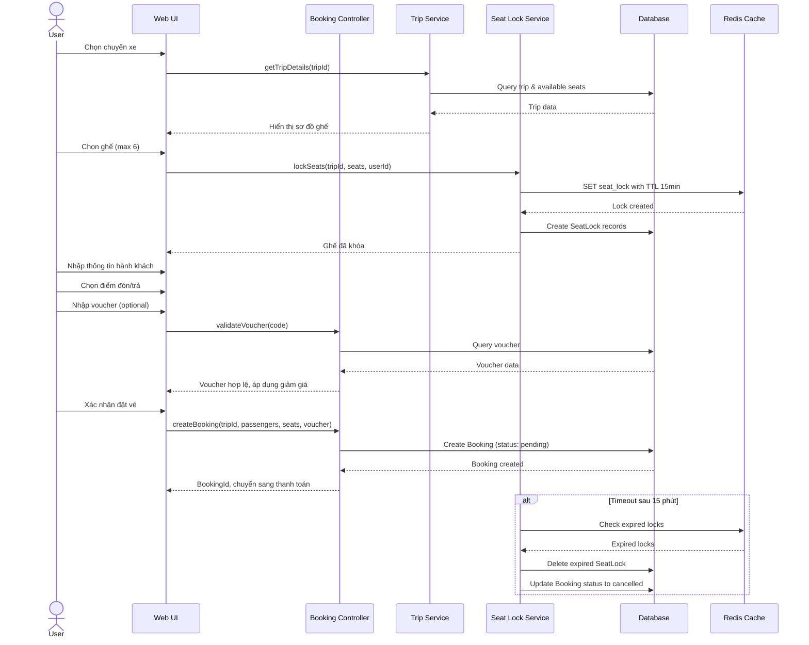

#### **3.1.2 UC-6: Thanh Toán**

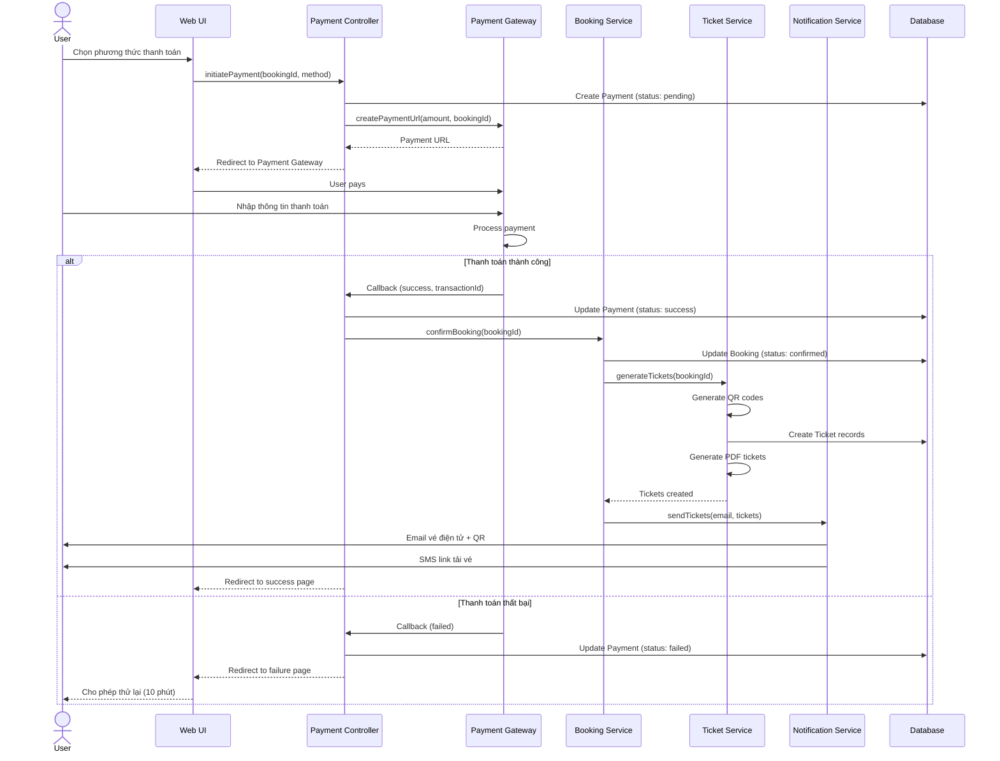

#### **3.1.3 UC-19: Quét QR Xác Thực Vé**

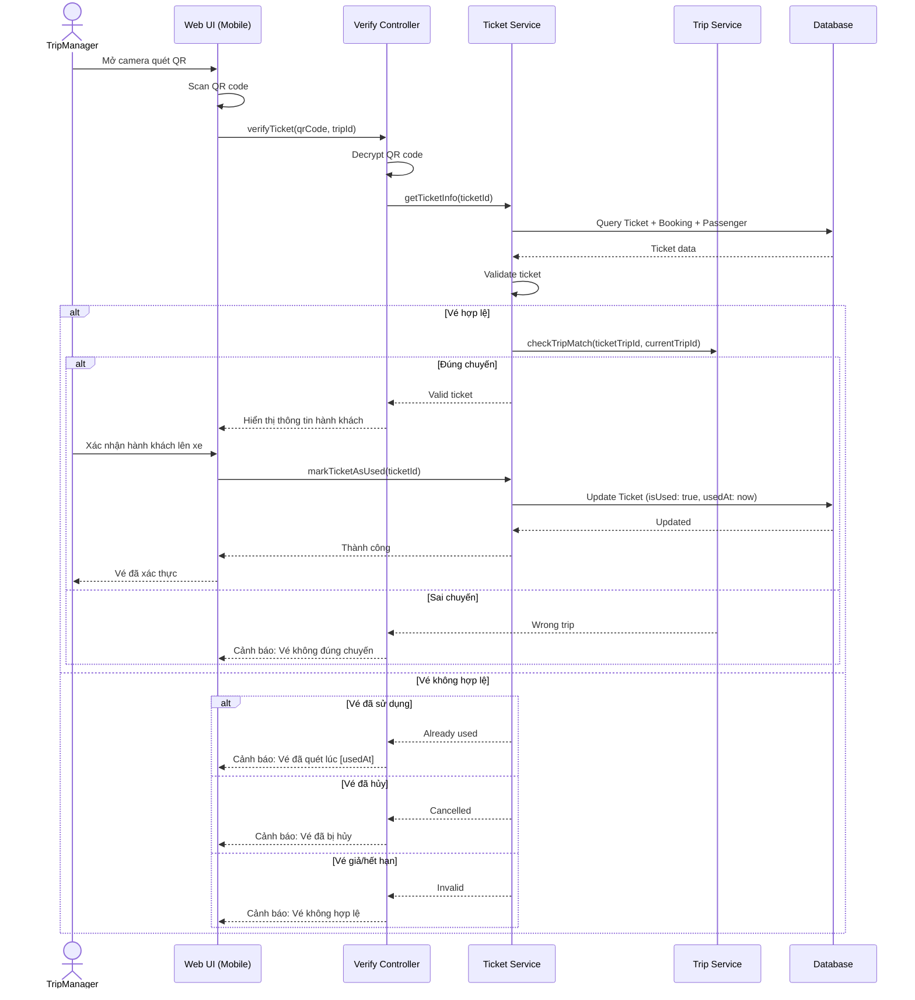

#### **3.1.4 UC-14: Tạo Lịch Trình Chuyến Xe**

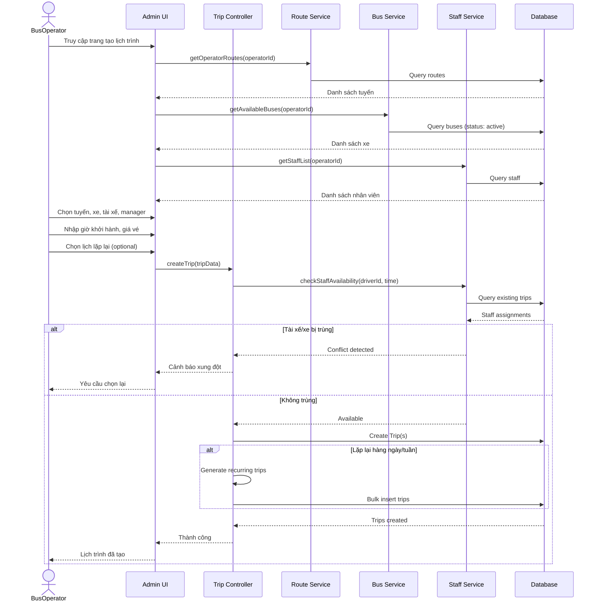

### 3.2 Activity Diagrams (Sơ Đồ Hoạt Động)

#### **3.2.1 Quy Trình Đặt Vé Hoàn Chỉnh (End-to-End)**

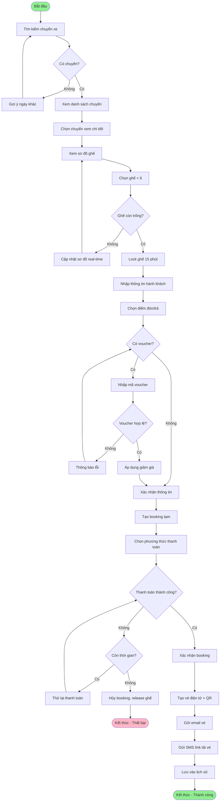

#### **3.2.2 Quy Trình Hủy Vé**

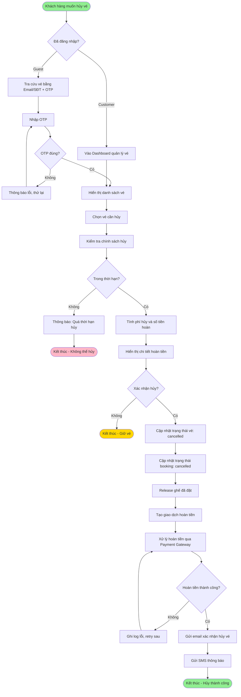

#### **3.2.3 Quy Trình Soát Vé**

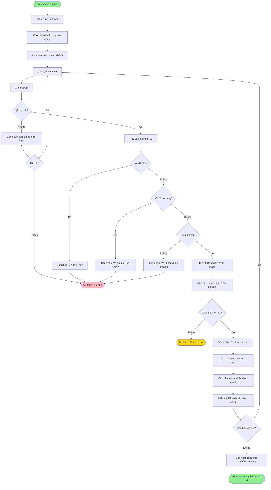

#### **3.2.4 Quy Trình Duyệt Nhà Xe Mới**

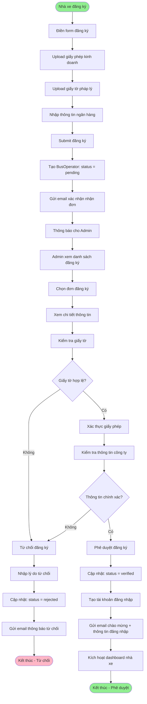

### 3.3 State Diagrams (Sơ Đồ Trạng Thái)

#### **3.3.1 Trạng Thái Booking**

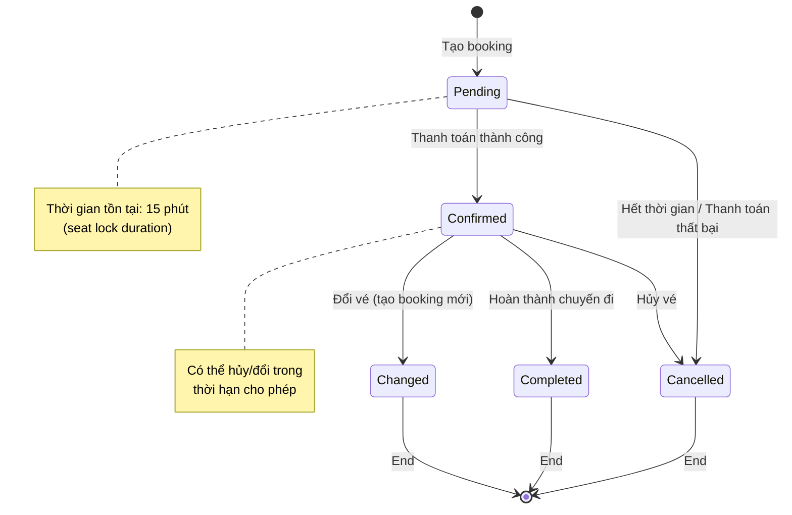

#### **3.3.2 Trạng Thái Ticket**

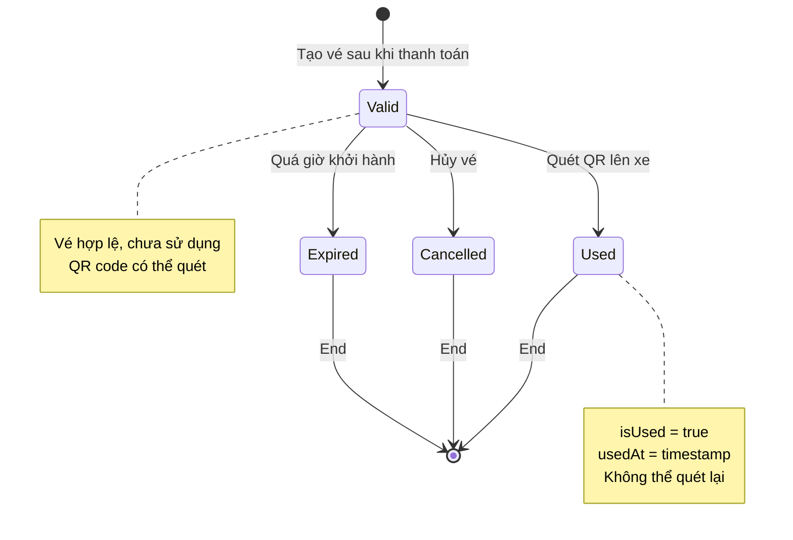

#### **3.3.3 Trạng Thái Trip**

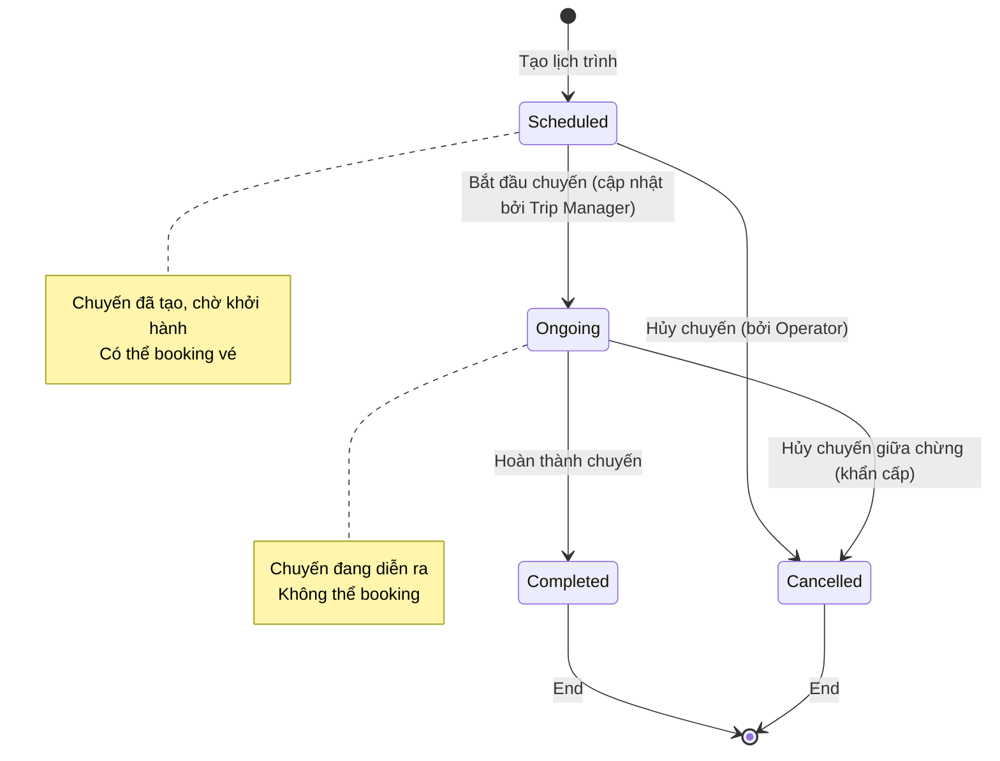

#### **3.3.4 Trạng Thái Payment**

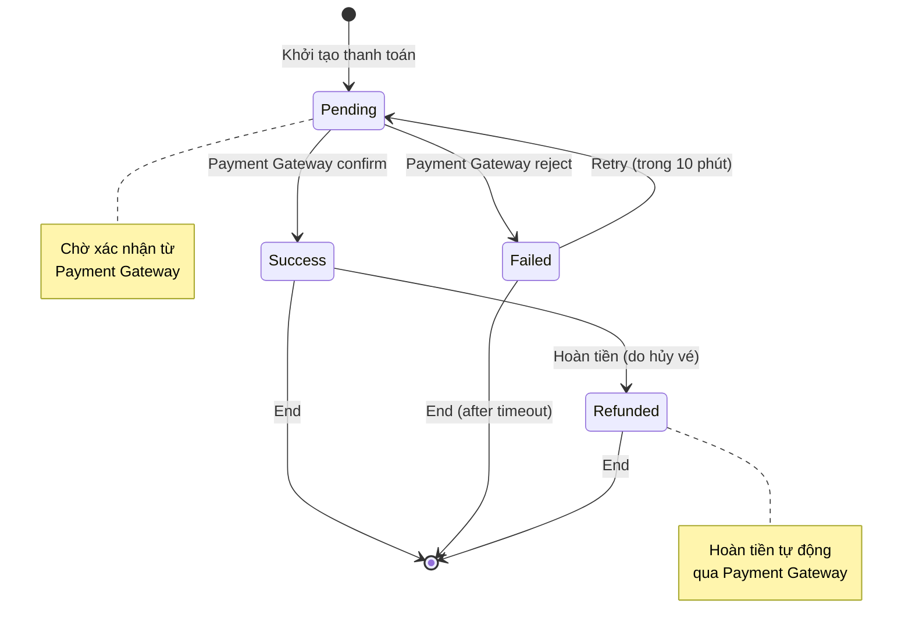

---

## 4. THIẾT KẾ KIẾN TRÚC HỆ THỐNG

### 4.1 Tổng Quan Kiến Trúc

Hệ thống áp dụng kiến trúc **3-tier** kết hợp với **Microservices** cho các service quan trọng:

- **Presentation Layer:** React SPA + Mobile-responsive Web
- **Application Layer:** RESTful API (Node.js + Express)
- **Data Layer:** MongoDB + Redis Cache

### 4.2 System Architecture Diagram

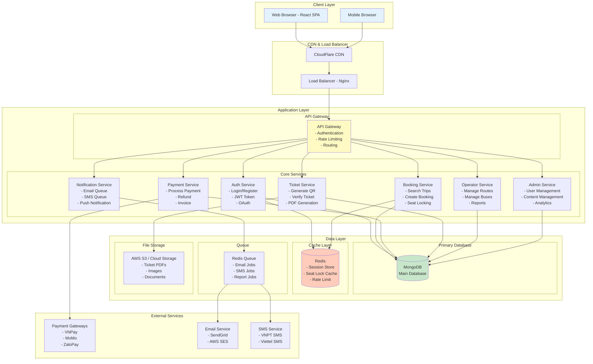

### 4.3 Component Diagram (Sơ Đồ Thành Phần)

```mermaid
graph TB
    subgraph "Frontend Components"
        subgraph "Customer App"
            SEARCH[Search & Filter]
            BOOKING_UI[Booking Flow]
            PAYMENT_UI[Payment UI]
            DASHBOARD[User Dashboard]
            REVIEW_UI[Review & Rating]
        end

        subgraph "Operator Admin"
            OP_DASH[Operator Dashboard]
            ROUTE_MGMT[Route Management]
            BUS_MGMT[Bus Management]
            SCHEDULE_MGMT[Schedule Management]
            STAFF_MGMT[Staff Management]
            REPORT[Revenue Reports]
        end

        subgraph "Trip Manager App"
            QR_SCANNER[QR Scanner]
            PASSENGER_LIST[Passenger List]
            TRIP_STATUS[Trip Status]
        end

        subgraph "System Admin"
            SYS_DASH[System Dashboard]
            USER_MGMT[User Management]
            APPROVAL[Operator Approval]
            CONTENT_MGMT[Content Management]
            ANALYTICS[Analytics & Reports]
        end
    end

    subgraph "Backend Components"
        subgraph "Core Modules"
            AUTH_MODULE[Authentication Module<br/>- JWT<br/>- OAuth<br/>- Session]
            BOOKING_MODULE[Booking Module<br/>- Search Engine<br/>- Seat Lock Manager<br/>- Price Calculator]
            PAYMENT_MODULE[Payment Module<br/>- Gateway Integration<br/>- Transaction Manager<br/>- Refund Handler]
            TICKET_MODULE[Ticket Module<br/>- QR Generator<br/>- PDF Generator<br/>- Verification Engine]
        end

        subgraph "Supporting Modules"
            NOTIFICATION_MODULE[Notification Module<br/>- Email Sender<br/>- SMS Sender<br/>- Template Engine]
            REPORT_MODULE[Report Module<br/>- Data Aggregator<br/>- Export Engine]
            CACHE_MODULE[Cache Module<br/>- Redis Manager<br/>- TTL Controller]
            FILE_MODULE[File Module<br/>- Upload Handler<br/>- S3 Integration]
        end
    end

    subgraph "Data Access Layer"
        USER_REPO[User Repository]
        BOOKING_REPO[Booking Repository]
        TRIP_REPO[Trip Repository]
        PAYMENT_REPO[Payment Repository]
        OPERATOR_REPO[Operator Repository]
    end

    SEARCH --> BOOKING_MODULE
    BOOKING_UI --> BOOKING_MODULE
    PAYMENT_UI --> PAYMENT_MODULE
    DASHBOARD --> AUTH_MODULE
    REVIEW_UI --> BOOKING_MODULE

    OP_DASH --> OPERATOR_REPO
    ROUTE_MGMT --> OPERATOR_REPO
    BUS_MGMT --> OPERATOR_REPO
    SCHEDULE_MGMT --> TRIP_REPO
    STAFF_MGMT --> OPERATOR_REPO
    REPORT --> REPORT_MODULE

    QR_SCANNER --> TICKET_MODULE
    PASSENGER_LIST --> TRIP_REPO
    TRIP_STATUS --> TRIP_REPO

    SYS_DASH --> ANALYTICS
    USER_MGMT --> USER_REPO
    APPROVAL --> OPERATOR_REPO
    CONTENT_MGMT --> FILE_MODULE

    BOOKING_MODULE --> BOOKING_REPO
    BOOKING_MODULE --> CACHE_MODULE
    PAYMENT_MODULE --> PAYMENT_REPO
    TICKET_MODULE --> FILE_MODULE
    NOTIFICATION_MODULE --> NOTIFICATION_MODULE

    style AUTH_MODULE fill:#FFE082
    style BOOKING_MODULE fill:#FFE082
    style PAYMENT_MODULE fill:#FFE082
    style TICKET_MODULE fill:#FFE082
```

### 4.4 Deployment Diagram (Sơ Đồ Triển Khai)

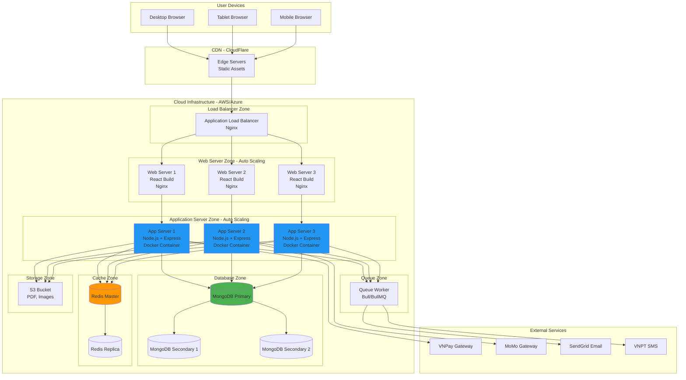

### 4.5 Database Schema (ERD - Implemented Models Only)

> **Chú thích:** ERD này chỉ hiển thị các collections ĐÃ ĐƯỢC IMPLEMENT trong MongoDB. Các quan hệ được thực hiện thông qua ObjectId references và embedded documents.

```mermaid
erDiagram
    %% ========== IMPLEMENTED COLLECTIONS ==========

    USER {
        ObjectId _id PK
        String email UK
        String phone UK
        String password
        String fullName
        Enum role
        Array savedPassengers
        Enum loyaltyTier
        Number totalPoints
        Boolean isActive
        DateTime createdAt
        DateTime updatedAt
    }

    BUS_OPERATOR {
        ObjectId _id PK
        String companyName UK
        String email UK
        String businessLicense
        String taxCode
        Object address
        Object bankAccount
        Enum verificationStatus
        Number averageRating
        Number totalRevenue
        Boolean isActive
        DateTime createdAt
        DateTime updatedAt
    }

    ROUTE {
        ObjectId _id PK
        ObjectId operatorId FK
        String routeCode UK
        String routeName
        Object origin
        Object destination
        Array pickupPoints
        Array dropoffPoints
        Number distance
        Number estimatedDuration
        Boolean isActive
    }

    BUS {
        ObjectId _id PK
        ObjectId operatorId FK
        String busNumber UK
        Enum busType
        Number totalSeats
        Object seatLayout
        Array amenities
        Array images
        Boolean isActive
        Enum maintenanceStatus
    }

    TRIP {
        ObjectId _id PK
        ObjectId operatorId FK
        ObjectId routeId FK
        ObjectId busId FK
        String tripCode UK
        DateTime departureTime
        DateTime arrivalTime
        Number basePrice
        Number availableSeats
        Array occupiedSeats
        Array lockedSeats
        ObjectId driver FK
        ObjectId tripManager FK
        Enum status
    }

    BOOKING {
        ObjectId _id PK
        String bookingCode UK
        ObjectId customerId FK
        ObjectId tripId FK
        ObjectId operatorId FK
        Array seats
        Object pickupPoint
        Object dropoffPoint
        Number subtotal
        Number discount
        Number totalAmount
        ObjectId voucherId FK
        String contactEmail
        String contactPhone
        Enum status
        DateTime createdAt
    }

    TICKET {
        ObjectId _id PK
        String ticketCode UK
        ObjectId bookingId FK
        ObjectId customerId FK
        ObjectId tripId FK
        String seatNumber
        Object passenger
        String qrCode
        String qrData
        Boolean isUsed
        DateTime usedAt
        ObjectId validatedBy FK
        Object tripDetails
    }

    PAYMENT {
        ObjectId _id PK
        String transactionId UK
        ObjectId bookingId FK
        ObjectId customerId FK
        Number amount
        Enum paymentMethod
        String gatewayTransactionId
        Enum status
        Number refundAmount
        DateTime createdAt
    }

    %% ========== RELATIONSHIPS ==========

    %% BusOperator relationships
    BUS_OPERATOR ||--o{ ROUTE : "manages"
    BUS_OPERATOR ||--o{ BUS : "owns"
    BUS_OPERATOR ||--o{ TRIP : "operates"

    %% Route & Bus relationships
    ROUTE ||--o{ TRIP : "has trips"
    BUS ||--o{ TRIP : "used in trips"

    %% User relationships
    USER ||--o{ BOOKING : "makes bookings"
    USER ||--o{ PAYMENT : "makes payments"
    USER ||--o{ TICKET : "has tickets"

    %% Trip relationships
    TRIP ||--o{ BOOKING : "has bookings"
    TRIP ||--o{ TICKET : "generates tickets"

    %% Booking relationships
    BOOKING ||--|| PAYMENT : "has payment"
    BOOKING ||--o{ TICKET : "generates tickets"

    %% Notes
    %%{ Note: seatLayout, lockedSeats, passengers are EMBEDDED in parent documents }%%
    %%{ Note: Staff and Voucher models are NOT implemented yet but referenced }%%
```

**Ghi Chú Quan Trọng:**

**1. Embedded vs Referenced:**
- ✅ **Referenced (FK):** `operatorId`, `routeId`, `busId`, `customerId`, `tripId`, `bookingId`
- 📦 **Embedded:** `savedPassengers`, `address`, `bankAccount`, `origin`, `destination`, `pickupPoints`, `dropoffPoints`, `seatLayout`, `occupiedSeats`, `lockedSeats`, `seats`, `passenger`, `tripDetails`

**2. Missing Collections (Referenced but NOT Implemented):**
- 🔴 `STAFF` - Referenced in `Trip.driver` and `Trip.tripManager`
- 🔴 `VOUCHER` - Referenced in `Booking.voucherId`

**3. Indexes trong MongoDB:**
- All `_id` fields have automatic index
- Unique indexes: `email`, `phone`, `companyName`, `busNumber`, `routeCode`, `tripCode`, `bookingCode`, `ticketCode`, `transactionId`
- Compound indexes: `(operatorId, departureTime)`, `(routeId, departureTime)`, `('origin.city', 'destination.city')`

### 4.6 Technology Stack Chi Tiết

#### **Frontend**
- **Framework:** React 18.x
- **Build Tool:** Vite 5.x
- **UI Library:** Tailwind CSS 4.x + Ant Design / Material-UI
- **State Management:** Redux Toolkit / Zustand
- **HTTP Client:** Axios
- **QR Scanner:** html5-qrcode
- **PDF Viewer:** react-pdf
- **Form Handling:** React Hook Form + Yup validation
- **Date Picker:** Day.js
- **Charts:** Recharts / Chart.js
- **Maps:** Google Maps API (optional)

#### **Backend**
- **Runtime:** Node.js 20.x LTS
- **Framework:** Express.js 4.x
- **Language:** JavaScript (ES6+) / TypeScript (optional)
- **Authentication:** JWT (jsonwebtoken) + Passport.js
- **Validation:** Joi / Yup
- **ORM:** Mongoose (for MongoDB)
- **Queue:** Bull / BullMQ (Redis-based)
- **File Upload:** Multer + AWS SDK
- **QR Code:** qrcode / qr-image
- **PDF Generation:** PDFKit / Puppeteer
- **Email:** Nodemailer + SendGrid
- **SMS:** REST API calls to VNPT/Viettel
- **Payment:** SDK/API integration (VNPay, MoMo, ZaloPay)
- **Logging:** Winston / Pino
- **Testing:** Jest + Supertest

#### **Database & Cache**
- **Primary DB:** MongoDB 6.x (Replica Set)
- **Cache:** Redis 7.x (Master-Replica)
- **Session Store:** Redis
- **Full-text Search:** MongoDB Text Search / Elasticsearch (optional)

#### **DevOps & Infrastructure**
- **Containerization:** Docker + Docker Compose
- **Orchestration:** Kubernetes (optional) / Docker Swarm
- **Web Server:** Nginx
- **CI/CD:** GitHub Actions / GitLab CI
- **Cloud Provider:** AWS / Azure / GCP
- **CDN:** CloudFlare
- **Monitoring:** Prometheus + Grafana / DataDog
- **Logging:** ELK Stack (Elasticsearch, Logstash, Kibana)
- **APM:** New Relic / AppDynamics (optional)

#### **Security**
- **HTTPS/TLS:** Let's Encrypt SSL
- **Password Hashing:** bcrypt (cost factor 12)
- **Rate Limiting:** express-rate-limit + Redis
- **CORS:** cors middleware
- **Helmet:** helmet.js (security headers)
- **XSS Protection:** xss-clean
- **SQL Injection:** N/A (NoSQL, use parameterized queries)
- **CSRF:** csurf (for forms)

### 4.7 API Design Principles

#### **RESTful API Conventions**

**Base URL:** `https://api.quickride.vn/v1`

**Authentication:**
```
Authorization: Bearer <JWT_TOKEN>
```

**Response Format:**
```json
{
  "success": true,
  "data": { ... },
  "message": "Operation successful",
  "timestamp": "2025-01-15T10:30:00Z"
}
```

**Error Format:**
```json
{
  "success": false,
  "error": {
    "code": "INVALID_VOUCHER",
    "message": "Voucher không hợp lệ hoặc đã hết hạn",
    "details": { ... }
  },
  "timestamp": "2025-01-15T10:30:00Z"
}
```

**HTTP Status Codes:**
- `200 OK` - Thành công
- `201 Created` - Tạo resource thành công
- `400 Bad Request` - Request không hợp lệ
- `401 Unauthorized` - Chưa xác thực
- `403 Forbidden` - Không có quyền
- `404 Not Found` - Không tìm thấy
- `409 Conflict` - Xung đột (vd: email đã tồn tại)
- `422 Unprocessable Entity` - Validation error
- `500 Internal Server Error` - Lỗi server

**Các Endpoint Chính:**

**Auth:**
- `POST /auth/register` - Đăng ký
- `POST /auth/login` - Đăng nhập
- `POST /auth/logout` - Đăng xuất
- `POST /auth/refresh-token` - Làm mới token
- `POST /auth/forgot-password` - Quên mật khẩu
- `POST /auth/verify-otp` - Xác thực OTP

**Trips:**
- `GET /trips/search` - Tìm kiếm chuyến
- `GET /trips/:tripId` - Chi tiết chuyến
- `GET /trips/:tripId/seats` - Sơ đồ ghế

**Bookings:**
- `POST /bookings` - Tạo booking
- `GET /bookings/:bookingId` - Chi tiết booking
- `PUT /bookings/:bookingId/cancel` - Hủy vé
- `PUT /bookings/:bookingId/change` - Đổi vé
- `GET /bookings/my-bookings` - Danh sách vé của user

**Payments:**
- `POST /payments/initiate` - Khởi tạo thanh toán
- `POST /payments/callback` - Callback từ gateway
- `GET /payments/:paymentId` - Trạng thái thanh toán

**Tickets:**
- `GET /tickets/:ticketId` - Chi tiết vé
- `POST /tickets/verify` - Xác thực vé (quét QR)
- `GET /tickets/:ticketId/download` - Tải PDF

**Operators (Nhà xe):**
- `GET /operators/routes` - Danh sách tuyến
- `POST /operators/routes` - Tạo tuyến
- `GET /operators/buses` - Danh sách xe
- `POST /operators/buses` - Thêm xe
- `POST /operators/trips` - Tạo lịch trình
- `GET /operators/reports/revenue` - Báo cáo doanh thu

**Admin:**
- `GET /admin/users` - Quản lý users
- `GET /admin/operators/pending` - Duyệt nhà xe
- `PUT /admin/operators/:id/approve` - Phê duyệt
- `GET /admin/reports/system` - Báo cáo hệ thống

### 4.8 Chiến Lược Scaling & Performance

#### **Horizontal Scaling**
- Auto-scaling cho App Servers dựa trên CPU/Memory usage
- Load balancing với Nginx (Round Robin / Least Connections)
- Stateless API design để dễ scale

#### **Database Optimization**
- MongoDB Replica Set (1 Primary + 2 Secondary)
- Indexes on: userId, tripId, bookingId, email, phoneNumber
- Sharding theo operatorId cho dữ liệu lớn (future)

#### **Caching Strategy**
- Redis cache cho:
  - Session data (TTL: 30 phút)
  - Seat locks (TTL: 15 phút)
  - Trip search results (TTL: 5 phút)
  - Rate limiting counters
- CDN cache cho static assets (images, CSS, JS)

#### **Queue Management**
- Async processing cho:
  - Email sending
  - SMS sending
  - Report generation
  - PDF ticket generation
- Queue prioritization: Critical > Normal > Low

#### **Performance Targets**
- **API Response Time:** < 200ms (p95)
- **Database Query:** < 100ms (p95)
- **Page Load:** < 2 seconds (First Contentful Paint)
- **Concurrent Users:** 5,000+
- **Throughput:** 1,000 requests/second

---

## KẾT LUẬN

Tài liệu này cung cấp cái nhìn tổng quan và chi tiết về:
1. **28 Use Cases** được đặc tả ngắn gọn với luồng chính và thay thế
2. **24 lớp chính** với thuộc tính và phương thức được xác định rõ ràng
3. **Các sơ đồ UML:** Class Diagram, Sequence Diagrams, Activity Diagrams, State Diagrams
4. **Kiến trúc hệ thống:** 3-tier architecture với microservices, deployment diagram, component diagram
5. **Technology stack** và API design principles

Tài liệu này đồng bộ với **Tai_lieu_xay_dung_ung_dung.txt** và bổ sung các thông tin thiết kế cần thiết để triển khai hệ thống.

---

**Phiên bản:** 1.0
**Ngày cập nhật:** 2025-01-15
**Người soạn:** System Analyst Team
